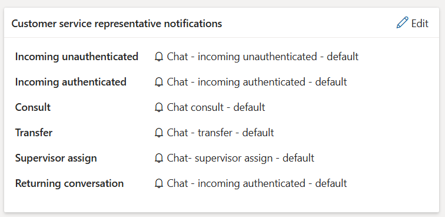

# Lab 10 - Work with Session Templates and associate template with workstreams

**Objective** - In this Lab, you will create a session template and associate scripts to this session template

## Task 1 - Create a session template

1.  In the site map of Copilot Service admin center,
    select **Workspaces** in **Support experience** group.

2.  On the **Workspaces** page, select **Manage** for **Session
    templates**.

3.  Select **New** on the **Active Session Templates** page.

4.  Specify the following on the **New Session Templates** page on the
    **General** Tab

    1.  **Name** – !!Contoso Session!!

    2.  **Unique Name** - !!msdyn_chat_custom!!

    3.  **Type** - Entity

    4.  **Entity** – Case

    5.  **Title** – !!{CustomerName}!!

    6.  **Communication panel mode** – Hidden

    7.  **Apply session title to anchor tab** – Yes

    8.  Select **Save**

## Task 2 - Associate application tabs, agents scripts with session templates

We will associate application tabs that need to open when a session is
started. Agents can't close these application tabs.

1.  On the session template page in the **Additional Tab** section, Select **Add Existing Application
    Tab Template**. The **Lookup Records** pane appears. Search for and select **Customer
    Summary**. Select **Add**. The application tabs are added to
    the session template.

    

    

2.  Select the **Scripts** tab and set the **Enable build
    expression** toggle to **Yes** to define the expression to set an
    agent script as default for a particular session template.

    

3.  Select **Save and close**.

## Task 3 - Associate or modify templates with workstreams

1.  In the Copilot Service Admin Center site map,
    select **Workstreams**.

    

2.  Select the **Contoso Chat workstream**

    

3.  Scroll down and expand the **Show advanced settings** section.

4.  Select **Edit** beside **Sessions**

    

5.  On the **Sessions** panel that appears, select **Chat session - default** in
    the **Default template** field.

    

6.  Select **Save and close**.

7.  Select **Edit** beside **Customer service representative notifications**

    

8.  On the **Customer service representative notifications** panel that appears, you can select the templates based on your requirements.

9.  Select **Save and close**.

**Summary** - You created session templates and associate scripts to this session templates
