## Lab 11 - Enable smart assist for the bot framework and guide agents with scripts

**Objective** - In this Lab, We create a bot user and add that bot user to the workstream

## Exercise 1 - Enable smart assist for the bot framework in Omnichannel for Customer Service

### Task 1 – Register an app in Microsoft Entra

1.  Open a new tab and open Microsoft Entra Admin center -
    <https://entra.microsoft.com/>

2.  Navigate to **Identity \> Applications \> App registration**

    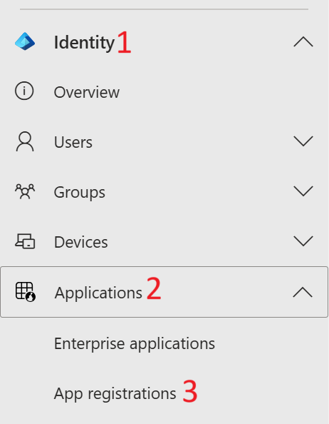

3.  Select **New Registration**

    

4.  Enter the name of the app as `Contoso App` and click on
    **Register**

    

5.  You will be navigated to the **Contoso App** page

    

### Task 2 - Configure the bot user as an omnichannel agent

The bot user is first created as an application user and then assigned
the **Omnichannel agent** role.

1.  Open a new tab in the browser and launch the PowerPlatform admin
    center - https://admin.powerplatform.com/.

2.  Select **Environments** on the left navigation pane

    

3.  Select the **Customer Service Trial** environment
    select **Settings**.

    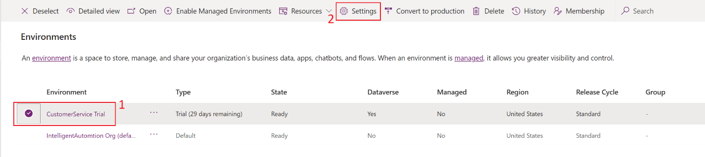

4.  On the **Settings** page, select **Users + permissions**, and then
    select **Application users**.

    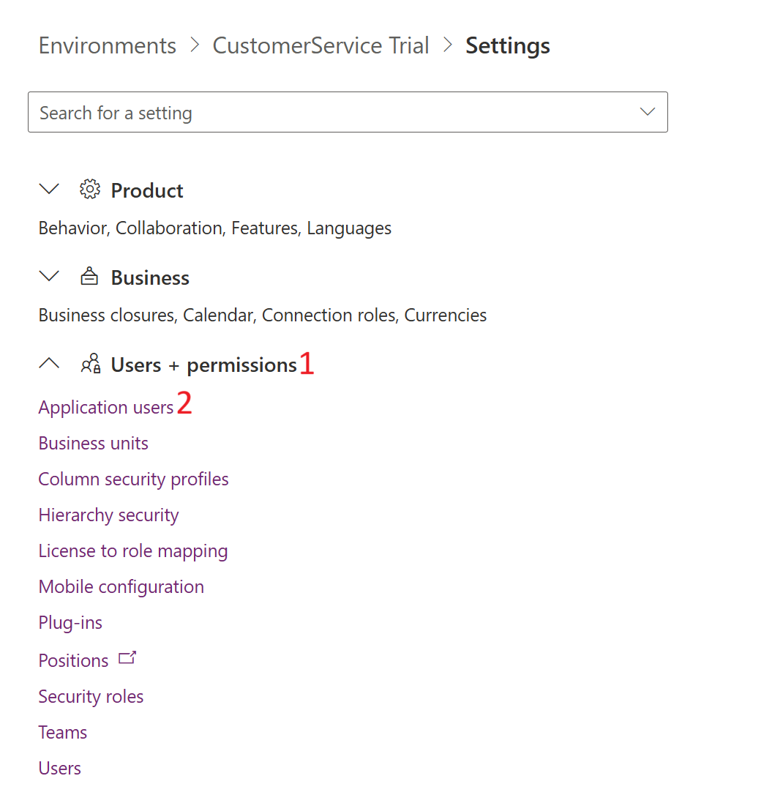

5.  On the **Application users** page, select **New app user** 

    

6.  In the **Create a new app user** dialog that opens. Select **Add an
    app**.

    

7.  Select the **Contoso App** and **Add** the app

    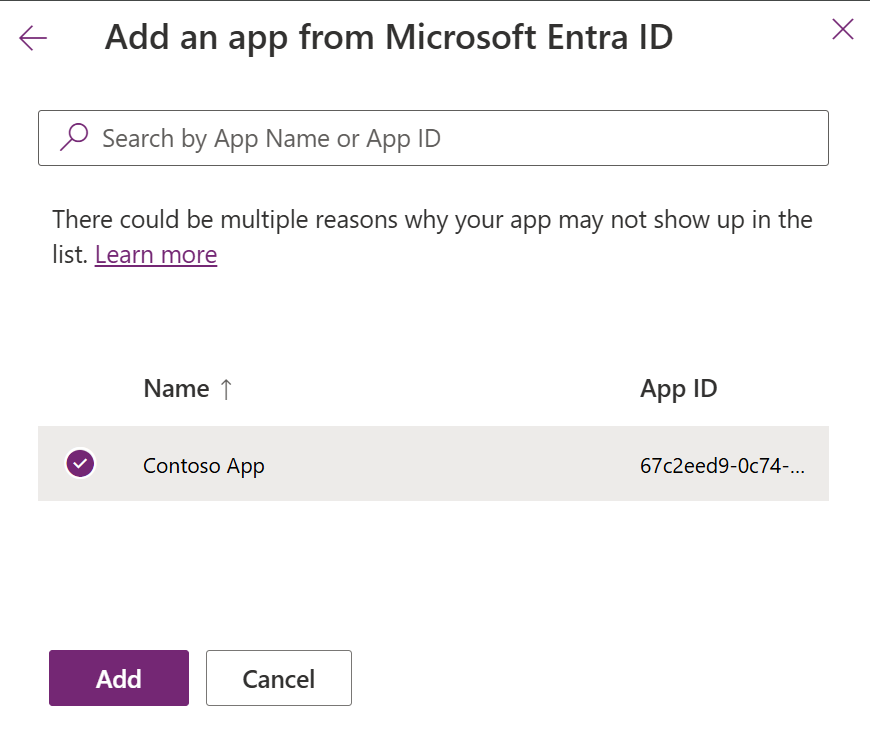

8.  Select a **Business unit** in the list.

    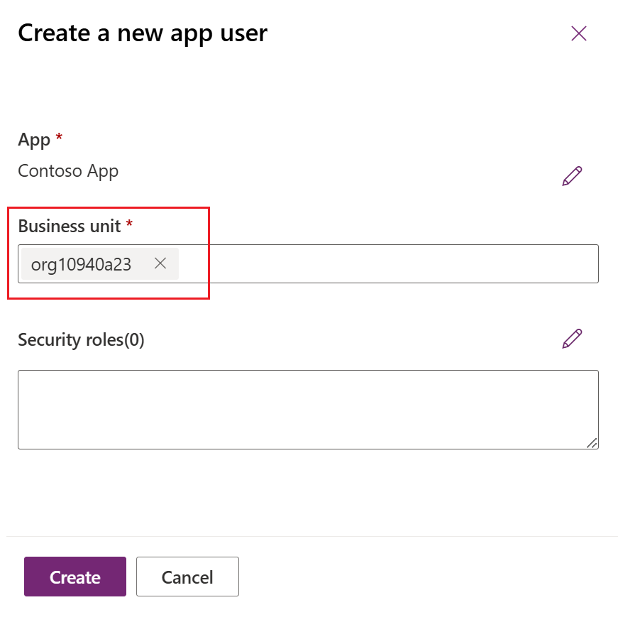

9.  Edit the **Security roles** field,

    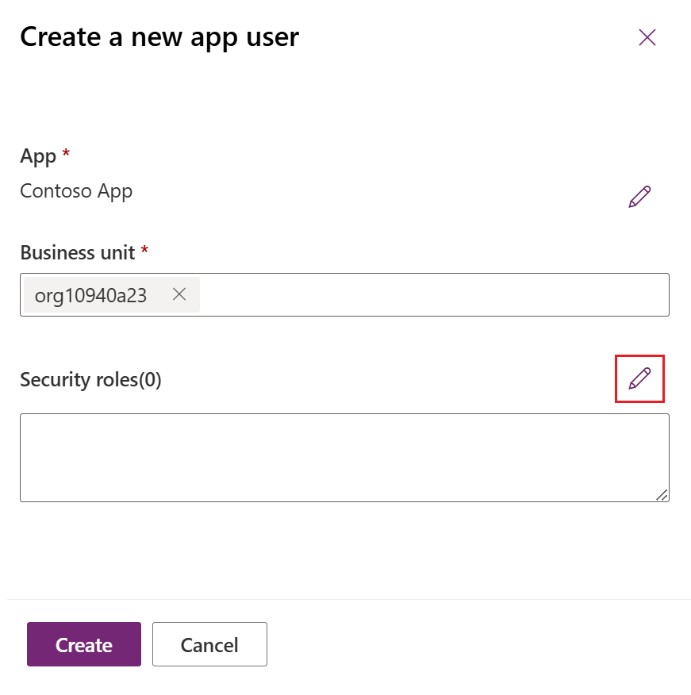

10. On the **Add security roles** page, select **Omnichannel
    agent** from the dropdown list and select **Save** to go back to
    **Create a new app user** dialog.

    

11. Select **Save**

    

12. Select **Create**

    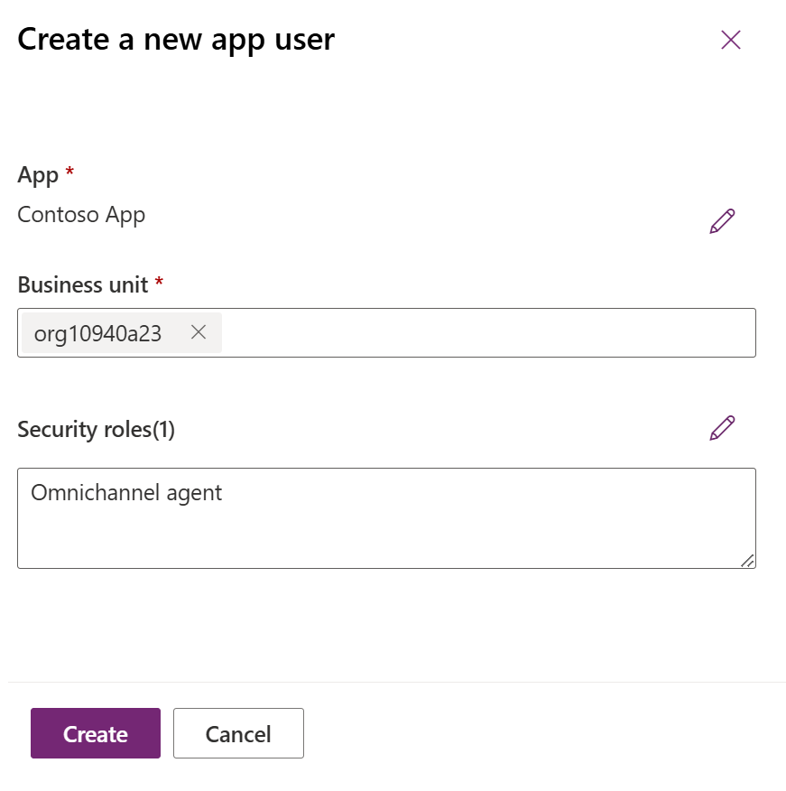

13. The App is successfully added.

    

14. Switch back to Customer Service Admin center. Select **Settings\>
    Advanced Settings**

    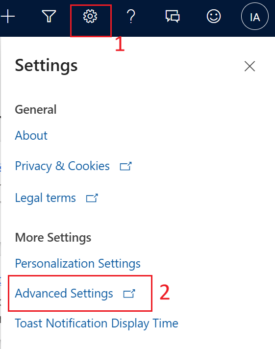

15. Select **System\> Security** from the left navigation pane.

    

16. Select **Manage users in Dynamics 365**

    

17. Select **Application Users** from the list of users

    

18. Select **Contoso App**

    

19. Select Application Users from the list.

    

20. Select **Bot Application user** under **User Type**

    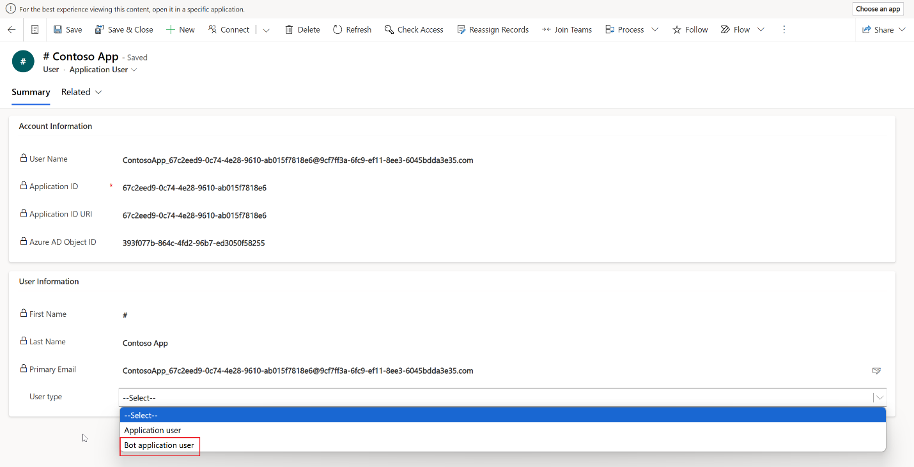

21. Switch back to the Entra admin center, copy the App ID of the app
    that is created in the previous task.

22. Under Bot application ID. Enter the application ID of the app that
    is created in Entra Admin center.

    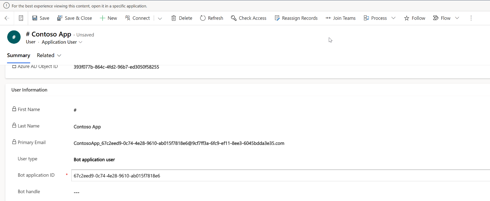

23. Select **Save & Close**

    

### Task 3 - Add a smart assist bot to a workstream

After you create a bot user, you need to add the bot to the workstream
so that agents who use the channel of this workstream can see the
suggestions.

1.  Switch back to Customer Service admin center, go
    to **Workstreams** in **Customer support**

    

2.  Select the workstream – **Contoso Chat Workstream** in which you
    want to add the smart assist bot.

    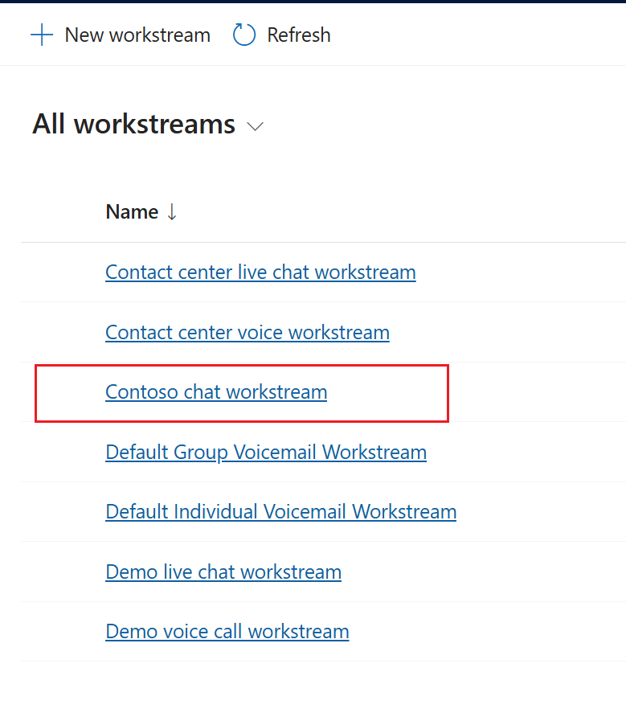

3.  Scroll down and expand **Show** **Advanced settings** and
    select **Add bot** in the **Smart Assist bots** area.

    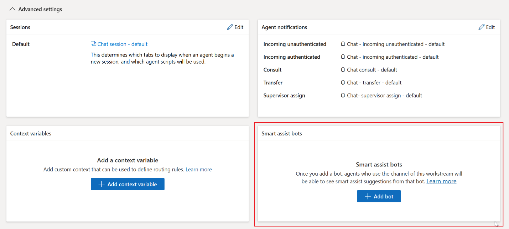

4.  In the **Add from existing** panel, select a bot user from the list,
    and then select **Add**.

    

    

You can add multiple bots to a workstream based on your business
requirements.

## Exercise 2 - Guide agents with scripts

### Task 1 - Create agent scripts

Create agent scripts in the admin center by following these steps:

1.  On the **Customer Service admin center**,
    select **Productivity** in **Agent experience**.

    

2.  On the **Productivity** page, select **Manage** for **Agent
    scripts**.

    

3.  On the **Agent scripts** page, select **New**.

4.  On the **New Agent script** page, specify the following:

    1.  Name – `Chat session script`

    2.  Unique Name – `Contoso_script`

    3.  Description - `This agent script is used for chat sessions.`

    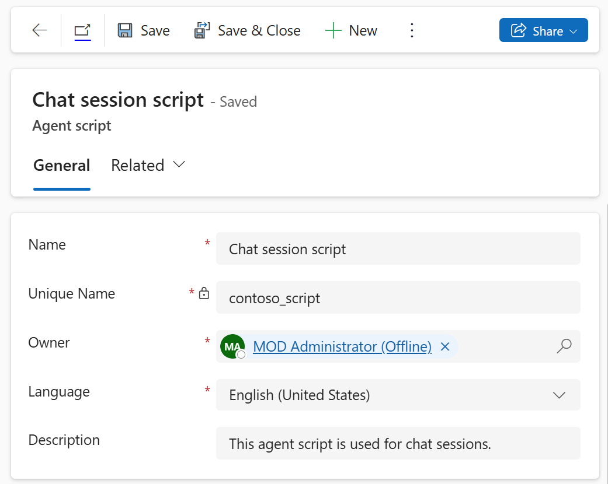

5.  Select **Save**. The **Agent script steps** appear.

    

6.  In the **Agent script steps** section, select **New Agent script
    step**. 

    

7.  Specify the following fields in the **New Agent script step** form.

    1.  Name - `Greet the customer.`

    2.  Unique Name - `Greet_script`

    3.  **Order** – `1`

    4.  **Action type – Text**

    5.  **Text instructions** - `Greet the customer with the welcome message`

8.  Select **Save and Close** to add, save, and close the quick-create
    form.

    

9.  Select **Save&Close** to save the changes.

### Task 2 - Associate an agent script with a session template

After you configure the agent script and add the field to a form, you
need to associate the agent script with a session template so that the
agent script will load for agents based on the type of session they've
opened.

1.  Select **Session templates** in **Workspaces**.

    

2.  Select a template from the list for which you want to associate the
    template. Select the **Chat session** **– default** template.

    

3.  Select the **Agent scripts** tab.

    

4.  In the **Agent scripts** section, select **Add Existing Agent
    script**. The **Lookup Records** pane appears.

    

5.  In the **Look for Records** box, select the search icon. Select the
    **Chat session script** from the list, and then select **Add**.

    

    

6.  Select **Save&Close**.

The agent script is associated with the session template.

**Summary** - We created a bot user and add that bot user to the workstream
