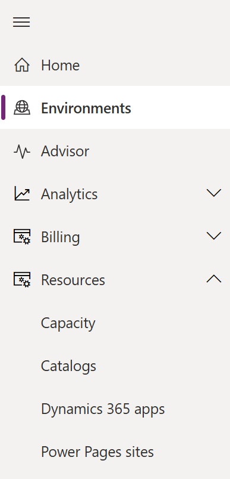
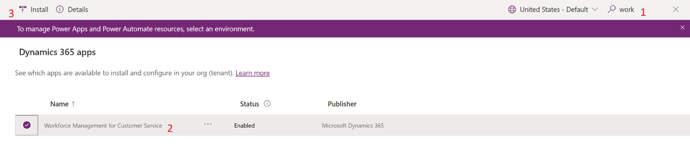
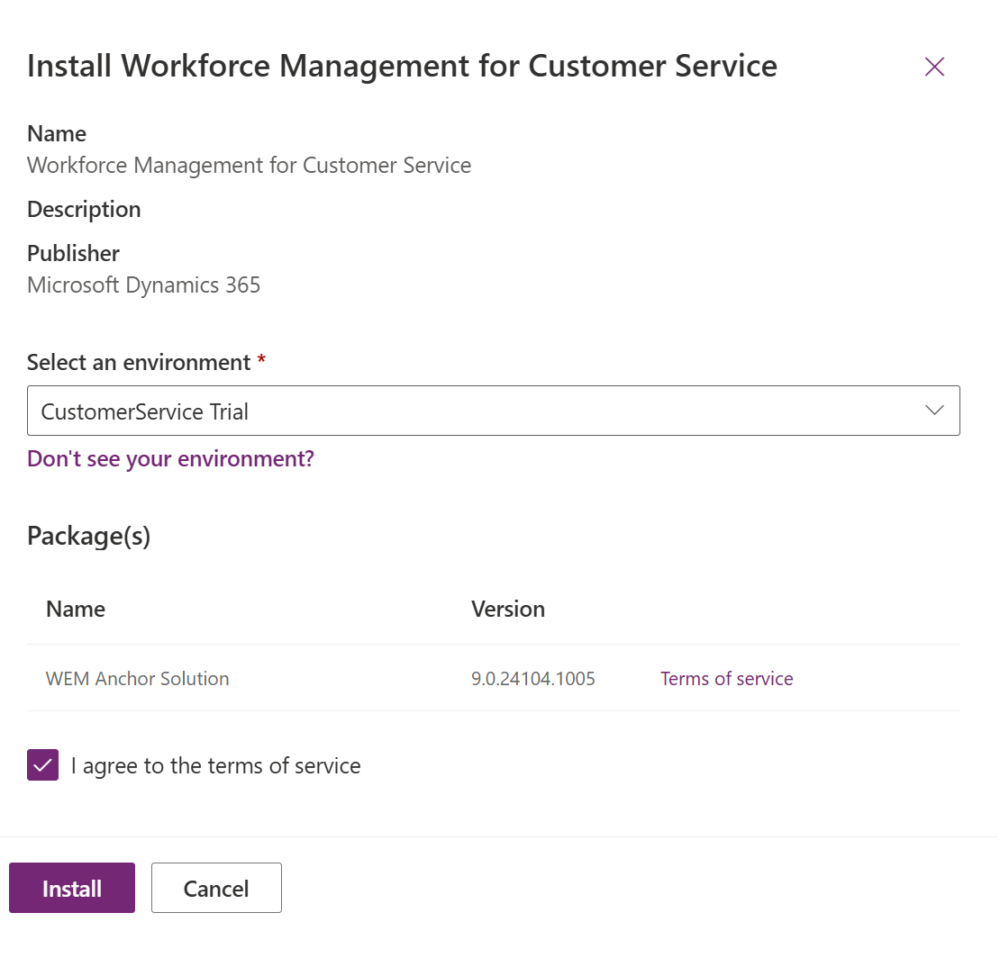
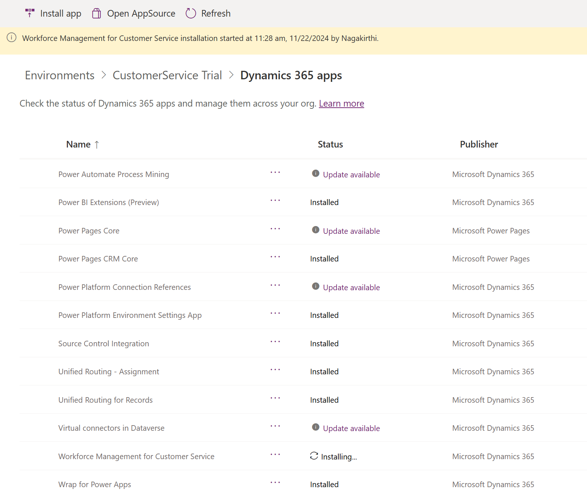
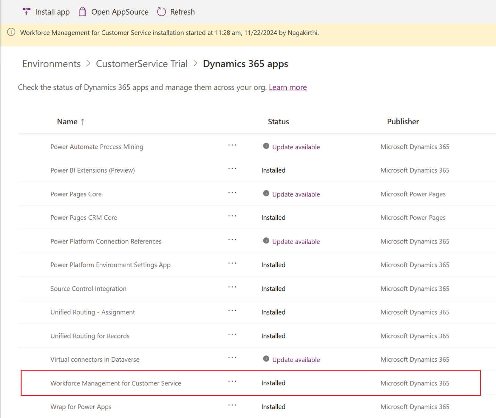
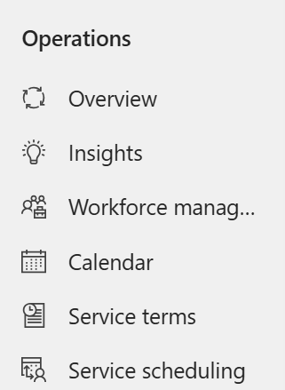
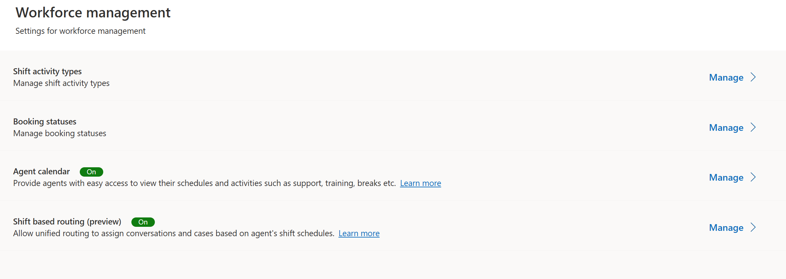
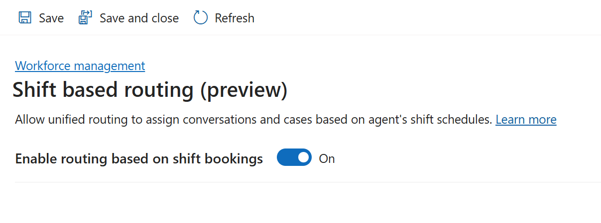

# Lab 12 - Configure routing based on external schedules

**Objective** - In this Lab, you enable workforce management and shift based routing.

## Task 1 - Enable workforce management

To enable Workforce Management, complete the following steps:

1. Navigate to your environment in Power Platform admin
    center - !!**https://admin.powerplatform.microsoft.com/**!! with the
    credentials provided to execute the labs.

2. On the command bar, select **Resources** \> **Dynamics 365 apps**.
    The Dynamics 365 apps page is displayed.

    

3. Search for **Workforce Management for Customer Service**, and then
    click **Install app**.

    

4. Select your Customer Service Trial environment. Agree to the terms of service, and
    then select **Install**.

    

5. Wait until the **Workforce Management for Customer Service** is installed on the **Dynamics 365 apps** page.

    **Note** – The installation approximately takes 10 minutes to complete.

    

    

## Task 2 - Enable shift-based routing

1.  Switch back to the Copilot Service admin center site map, refresh the portal and then select **Workforce
    management** under **Operations**.

    

2.  In the **Shift based routing (preview)** section, select **Manage**.

    

3.  On the **Shift based routing (preview)** page, turn on the **Enable
    routing based on shift bookings** toggle, and then select **Save**.

    

**Summary** - You enabled workforce management and shift based routing in Customer Service Admin center.
