# Lab 13 - Configure email and enable enhanced experience for email attachments

**Objective** - In this Lab, you will enable Power Apps trial to enhance email experience. You will also configure email attachment size limitations and enable enhanced experience for email attachments.

## Task 1 - Enable Power Apps free trial

1. Open a tab and paste the link of the Power Apps - !!https://powerapps.microsoft.com/!!

2. Login with the credentials provided to execute the lab. 

3. Click on **Try for free**

    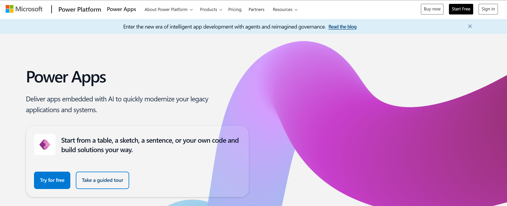

4. Enter the admin email ID and click on **Start free**.

    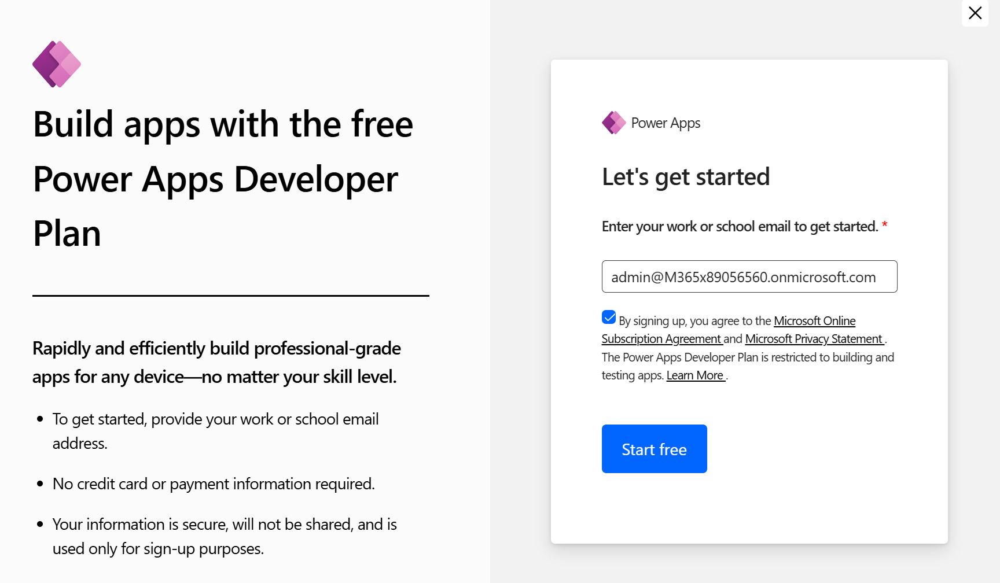

5. Select the Customer Service Trial environment on top right corner of the home page.

    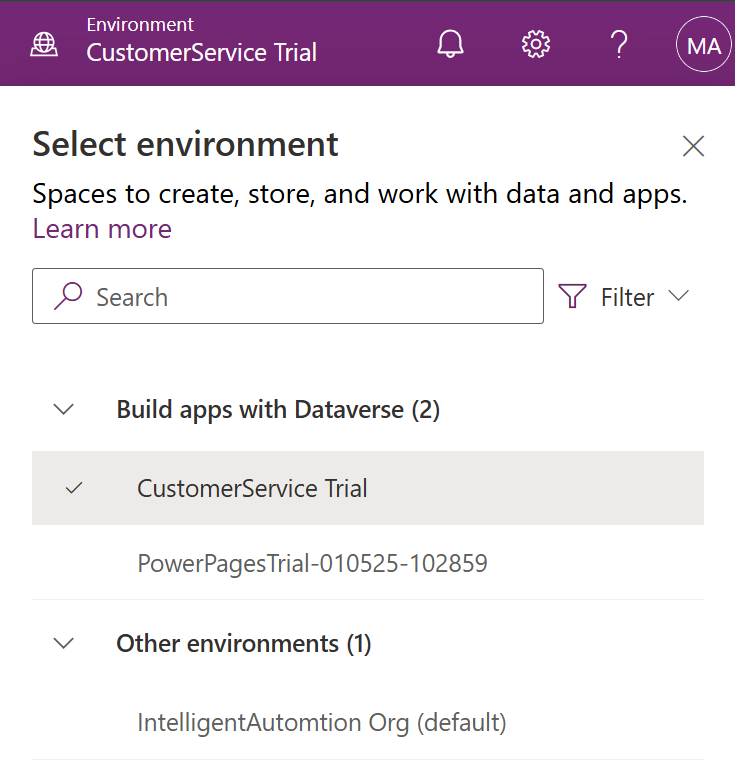

## Task 2 - Configure the email form order

Email must be enabled for users so they can view and access it. When
email is enabled, it shows as an option on the command bar.

To enable email:

1.  In Power Apps, go to **Settings** \> **Advanced Settings**.

2.  From the top menu, select **Settings** \> **Customizations\>
    Customizations.**

    

3.  Select **Customize the System**.

    

4.  Expand **Entities**.

5.  Select and expand **Email** and then select **Forms**.

    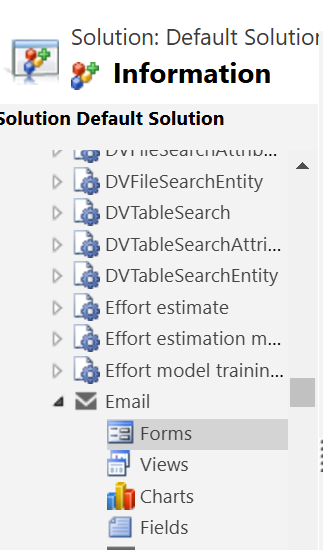

6.  On the command bar, select **Form Order**, and then select **Main
    Form Set** from the drop-down list.

    

7.  The **Form Order** window appears, which displays the enabled email
    forms that are available. If **Enhanced email** doesn't display at
    the top of the list, use the arrows to move it up so it displays
    first on the list, and then select **OK**.

    

8.  When you complete your updates, select **Publish All
    Customizations** in the top-left corner to display the changes.

    

    

## Task 3 - Enable the enhanced email experience

Enhanced email is the default setting, but you must enable email for
users to access and use the features.

1.  Open your **Customer Service Admin Center** App.

2.  In the app, go to **Settings** \> **Advanced Settings**.

    

3.  Select **System** \> **Administration**.

    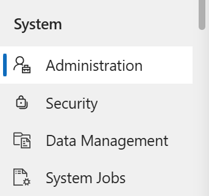

4.  On the **System Settings** page select **Email** tab.

    

5.  Scroll down to the **Enhanced email for Timeline** section, and then
    select the check box.

    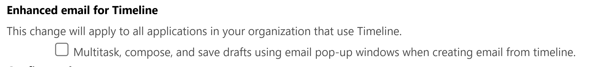

6.  Select **OK** to save your global organizational setting and close
    the window.

## Task 4 - Configure email attachment size limitations

You can manage file size limits for email file attachments by completing
the following steps:

1.  In Power Apps portal, select **Settings \> Advanced Settings.**

    

2.  In the **Settings** window, select **System \> Email Configuration**

    

3.  Select **Email Configuration Settings**.

    

4.  Scroll down to the **Set file size limit for attachments** section,
    set the file size you want to use for attachment, and then
    select **OK**.

    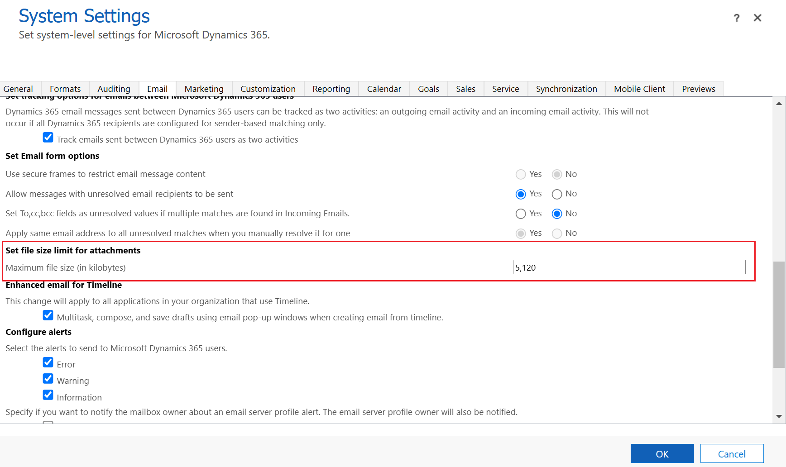

## Task 5 - Change the number of attachments to show per page

You can configure the maximum number of attachments to show per page.
Adjust the settings on the **Formatting** tab of the **List or Chart
properties** dialog. For example, if you set the **Number of
Rows** property to 4, and then have more than four attachments per
email, the rest of the attachments paginate and you can then use the
arrow buttons to view them.

## Task 6 - Manage blocked attachment file types

You can configure the attachment file types you want to block to prevent
users from uploading certain files.

1.  In Power Apps, go to **Advanced settings**.

2.  Select **System** \> **Administration** \> **System Settings**.

    

    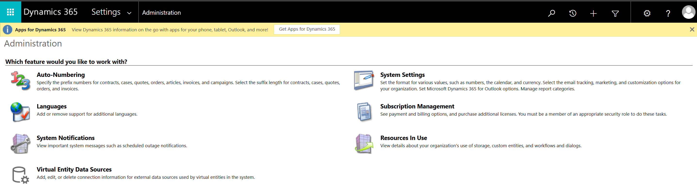

3.  On the **General** tab, scroll down to **Set blocked file extensions
    for attachments**.

4.  Type one or more file extensions you want to block. Users who try to
    upload a blocked file type see an error message that tells them the
    attachment is blocked. For Now, Select **OK**

    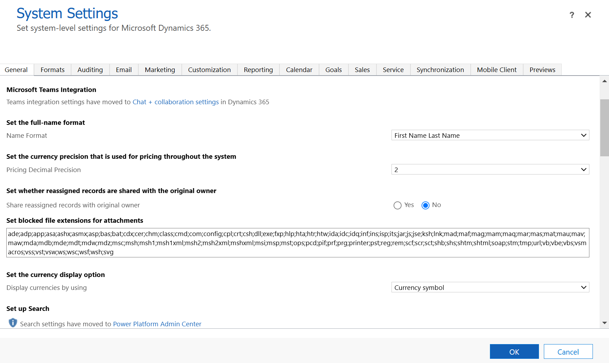

## Task 7 - Enable enhanced experience for email attachments

You can enable the enhanced email attachment control for forms to
provide a consistent email attachment experience to agents. Do the
following steps:

1.  In Power Apps - https://make.powerapps.com/, select the **Customer
    Service Trial** environment that contains your solution.

2.  Select **Tables**.

    

3.  Select **Email**.

    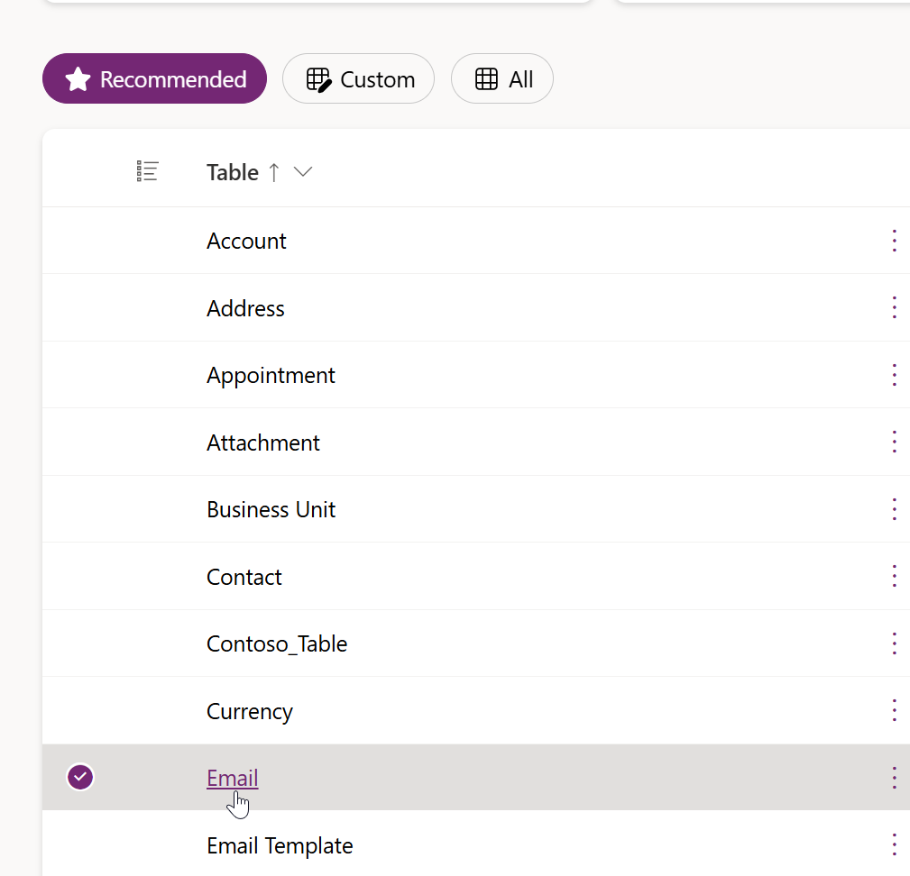

4.  Select **Forms** under **Data experiences**.

    

5.  Select the **Email** form.

    

6.  Select **Attachment** and the subgrid displays on the right hand side of
    the page

    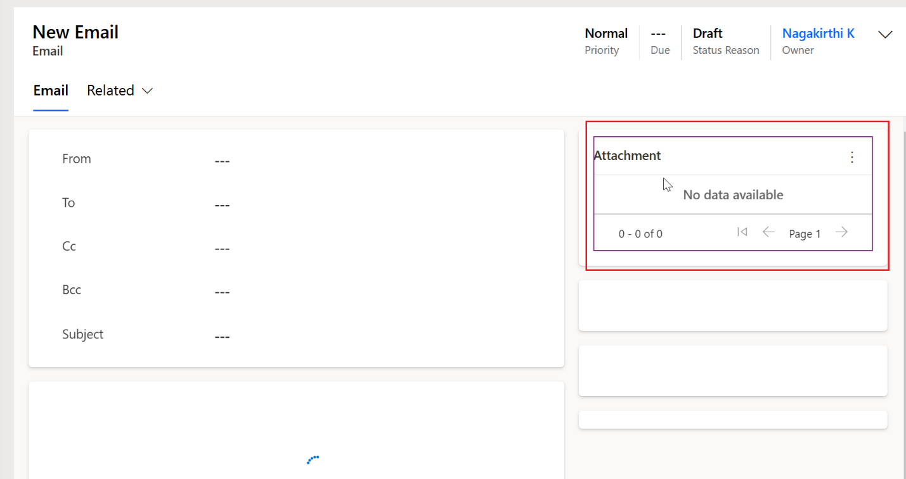

    

7.  Scroll down and expand **Components** select **+ Component**.

    

8.  Select **Get More Components**.

    

9.  Add **Attachments control** to **Components** in
    the **Attachment** subgrid properties.

10. Enter **Attachments control** and select the option from the list
    and Select **Add**.

    

    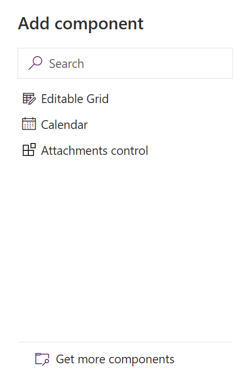

11. **Save and publish** the form.

**Summary** - You enabled Power Apps trial to enhance email experience. You also configured email attachment size limitations and enable enhanced experience for email attachments.
