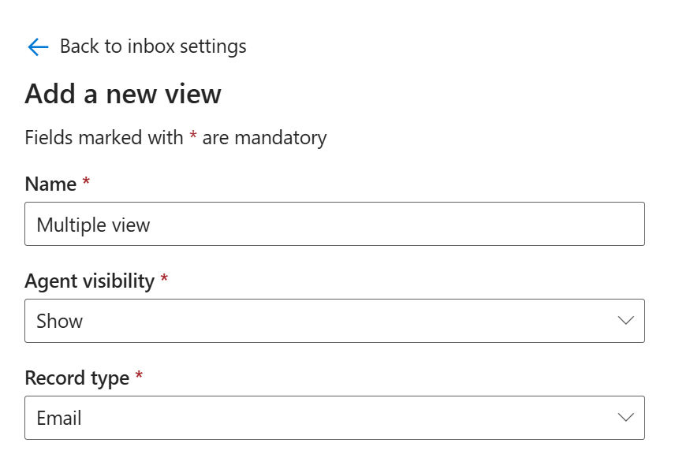
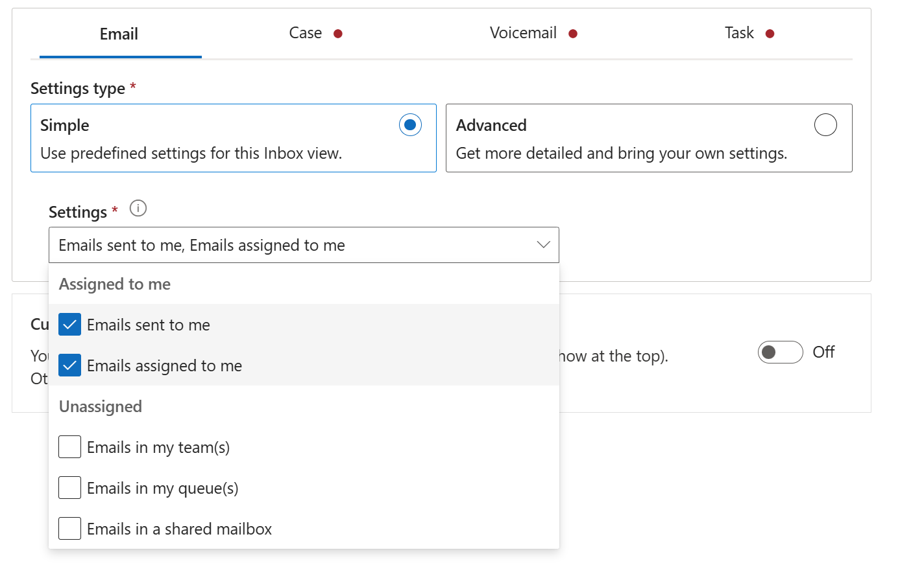

# Lab 14 - Configure the inbox setting for agents

**Objective** - In this Lab, you configure the inbox in Contact Center admin center or Customer Service admin center by editing the agent experience profile to meet your preferred inbox settings.

## Task 1 - Exploring the inbox setting for agents

You can configure the inbox in Contact Center admin center or Customer
Service admin center by editing the agent experience profile to meet
your preferred inbox settings.

1.  On the Customer Service admin center app, under **Agent experience**, select **Workspaces**.

3.  In **Agent experience profiles** section, select **Manage**.

4. Select the **Contoso Agent** profile.

5. Scroll down and select **Edit** under **Inbox**.

    

5.  On the **Inbox Settings** page, turn on the **Enable Inbox** toggle.

    

6.  Select a view and **Edit** to modify an existing view or create a
    view, and configure the following fields:

    - **Name:** Specify a name that shows in the inbox. Alphanumeric
      values are valid names.

    - **Record Type:** Select the record types for which the settings
      need to be applied. You can select more than one record type.

    - **Agent Visibility**: Select one of the following options to show
      or hide the view to agents:

      - **Show**

      - **Hide**

    

## Task 2 - Configure custom views for the inbox

You can configure a customized view for the inbox so that agents can see
their cases, conversations, emails, and voicemails all in a single view.

To configure multiple views for the inbox, complete the following steps.

1.  Go to the **Contoso Agent** Agent experience profile.

2.  On the **Inbox** card, select **Edit**. The **Inbox** page is
    displayed.

3.  Toggle **Enable Inbox** to **On** if it isn't already on, and then
    select **+ Add**. The **Add a new view** page is displayed.

4.  On the **Add a new view** page, enter the following details:

    - **Name**: Enter – `Multiple View`

    - **Agent visibility**: Select **Show**

    - **Record type**: Select **Email**

    

5.  For each record type, choose one of the following settings. The
    settings are different for each record type. Select **Simple** and
    select

    - Emails sent to me

    - Emails Assigned to me

    

6.  Select **Save and close**.

    

7.  Select **Save and close** again.

    

**Summary** - You configured the inbox in Contact Center admin center or Customer Service admin center by editing the agent experience profile to meet your preferred inbox settings.
