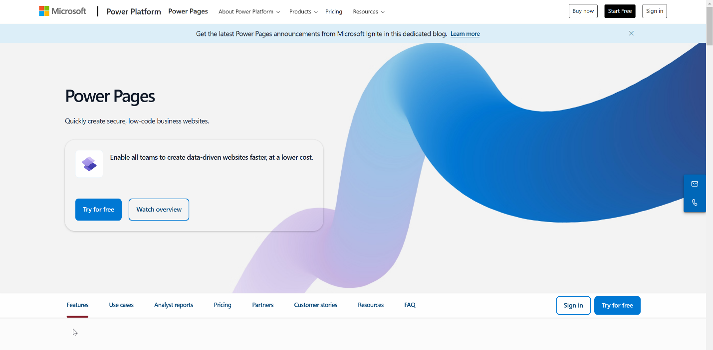
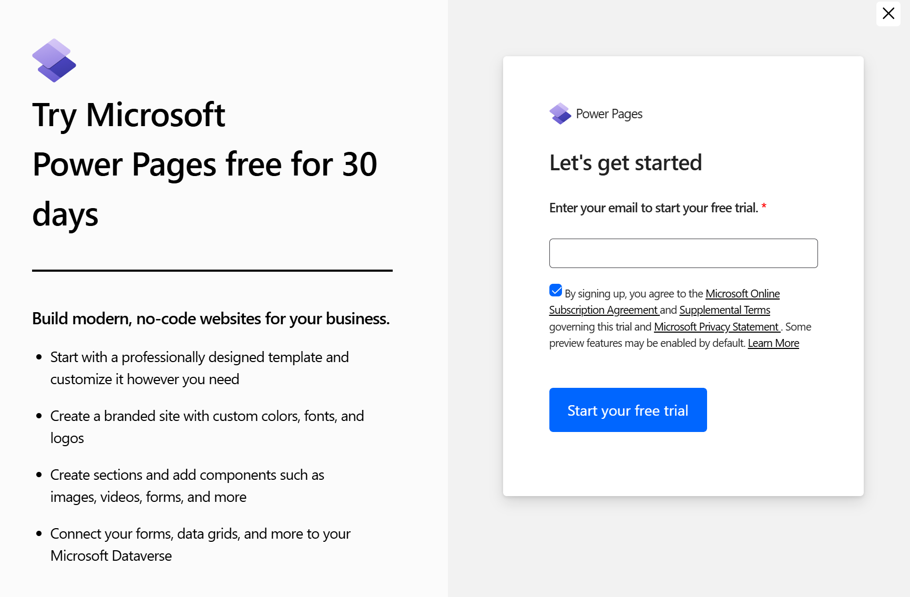
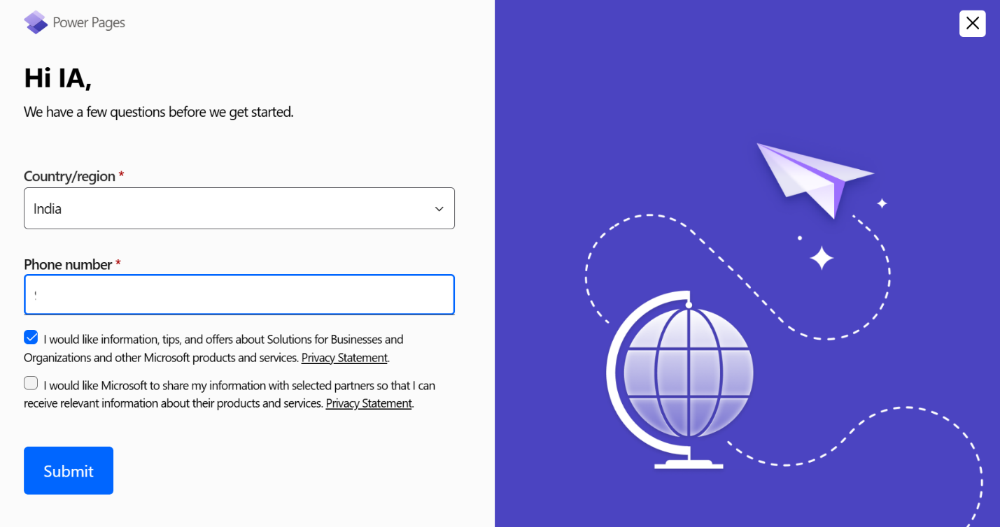
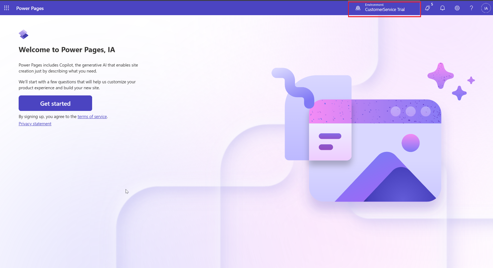
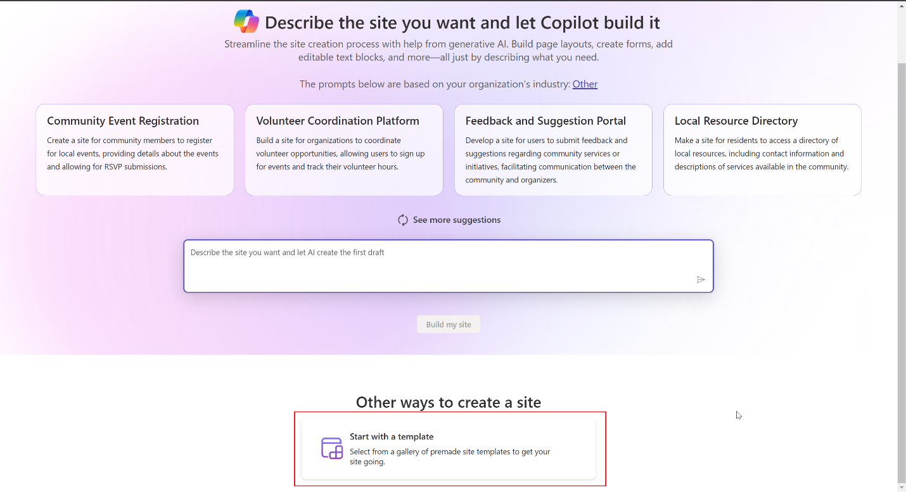
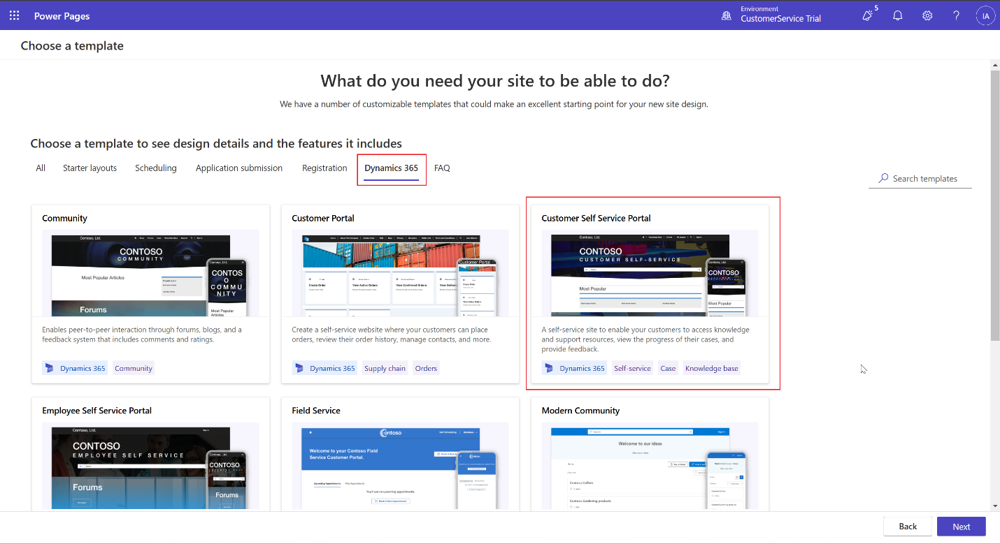
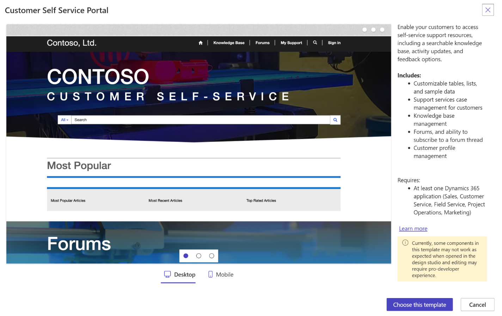
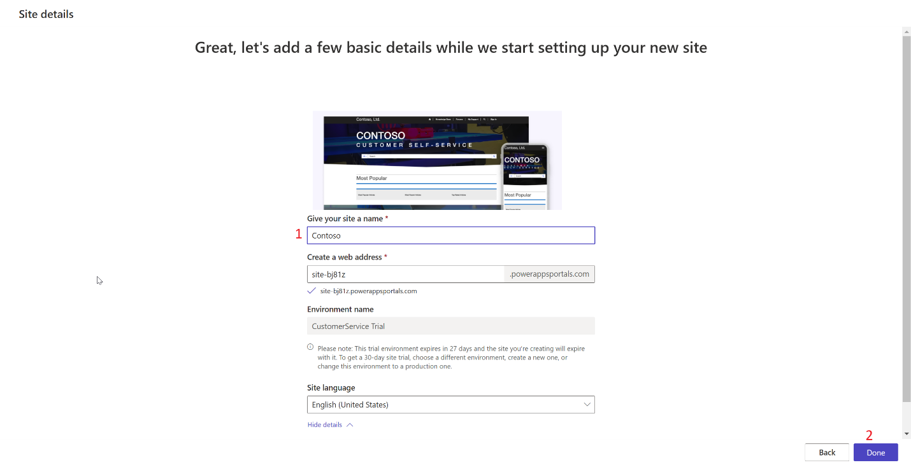
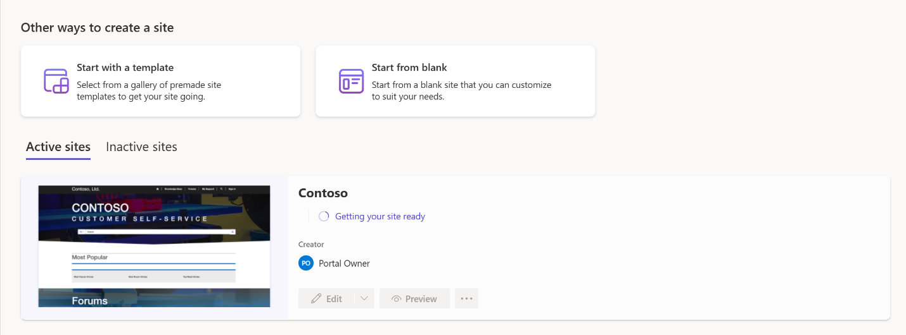
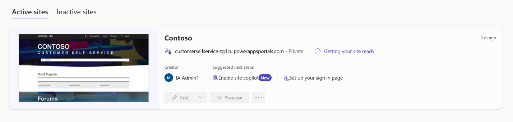

# Lab 16 - Configure a chat widget in Dynamics 365 Customer Service

**Objective** - In this Lab, you will configure a chat widget in Dynamics 365 Contact Center

## Task 1 - Create a website in Power Page trial

1.  Open a new tab in the browser. Go to **Power Pages** using https://www.microsoft.com/en-in/power-platform/products/power-pages.

2.  Select **Try for Free**.

    

3.  Enter the Email and select the checkbox for aggrement terms. Select
    **Start your free Trial**.

    

4.  Select the **Region** as **United States**, enter your **Phone number**
    and click on **Submit** for enabling the free trial.

    

5.  You will be navigated to **Power pages Home** page.

6.  Select the environment – **Customer Service Trial.** Select **Get
    Started**

    

7.  Select **Start with a template**.

    

8.  Select **Dynamics 365** tab and select **Customer Self-Service
    Portal**

    

9.  Select **Choose this template**.

    

10. Enter the site name – **Contoso.** Click on **Done**.

    

11. Wait until the site is created.

    

12. Refresh the page.

    

The site will be ready in approximately 20-25 minutes. You can proceed
with the next task.

## Task 2 – Exploring on configuring a chat widget

1.  Switch back to Customer Service admin center or Contact Center admin
    center, select **Channels** in **Customer support**.
    The **Channels** page appears.

    

2.  Select **Manage** for **Chat**. The **Chat channels** page appears.

    

3.  Select **Add chat channel**.

    

4.  On the **Channel details** page,

    - Name – **Contoso Chat Widget**

    - Language – **English – United States**

    - Select **Next.**

    

5.  On the workstream details page.

    - Select **Add to Existing Workstream**

    - Select **Contoso Chat Workstream**

    - Select **Next**

    

6.  On the **Chat Widget** page, leave the details as it is. Enable the
    **Proactive chat** toggle to **Yes.** Select **Next.**

    

1.  On the **Behaviors** page, under **Custom automated messages** –
    Select **Add a message**

    

2.  On **Add automated message** pane, select a trigger – **Agent
    assigned to conversation** from the **Message trigger** dropdown
    list.

3.  In the **Automated message** box, type the message – **Hi, how can I
    help you?** to be displayed.

4.  Select **Confirm**

    

    

5.  Enable the **Pre-conversation survey.** Select **Add**

6.  Enter the details

    - **Survey question name:** ContosoConsent

    - **Question text**: We collect demographic data. Please confirm
      whether you agree to provide the basic information.

    - **Answer type –** User consent

    - **Required -** Yes

    - Select **Confirm**.

    

7.  Select **Add** again

    - **Survey question name:** FirstName

    - **Question text**: FirstName

    - **Answer type –** Single line

    - **Required -** Yes

    - Select **Confirm**.

    

8.  Select **Add** again

    - **Survey question name:** LastName

    - **Question text**: LastName

    - **Answer type –** Single line

    - **Required -** Yes

    - Select **Confirm**.

    

9.  Select **Add** again

    - **Survey question name:** Age

    - **Question text**: Enter your Age

    - **Answer type –** Single line

    - **Required -** Yes

    - Select **Confirm**.

    

    

10. Set the toggle for **Post-conversation survey** to **Off**.

**Note - Authentication settings** option is enabled by default. Select
drop-down under **Authentication name** and select **Create
authentication setting.** The steps outlined below can be performed only
upon acquiring a paid license for Power Pages so that the custom
certificates can be uploaded to acquire a public Key URL

A Chat widget is then created. You can click on **Cancel** for this lab
as we have explored how to create a chat widget in Customer Service
Trail.

