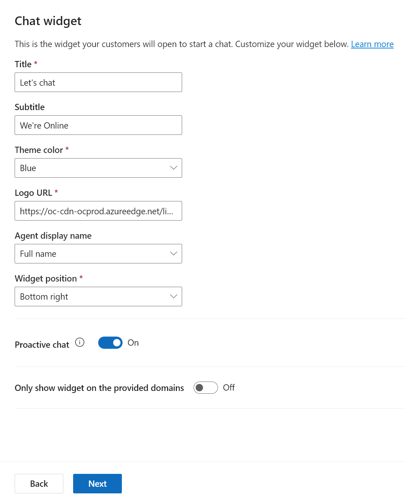
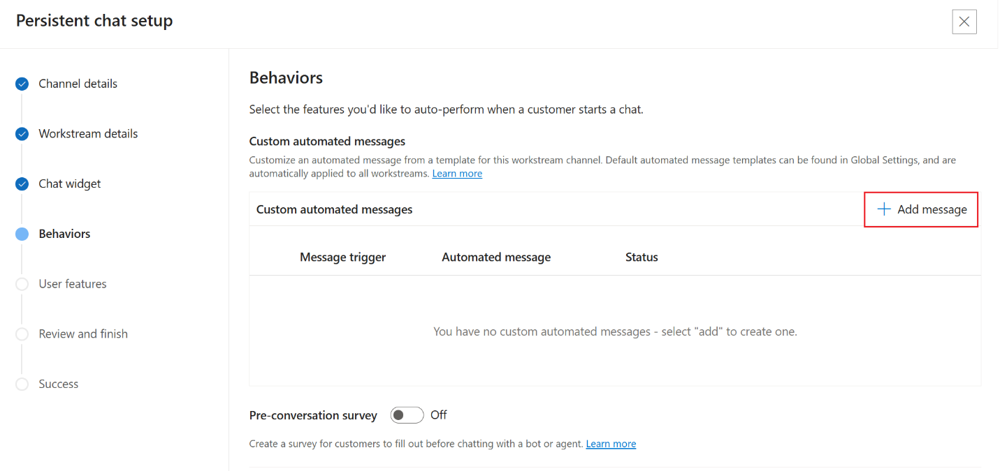
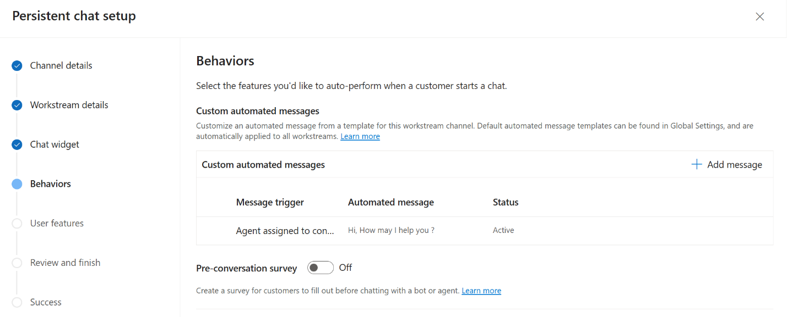
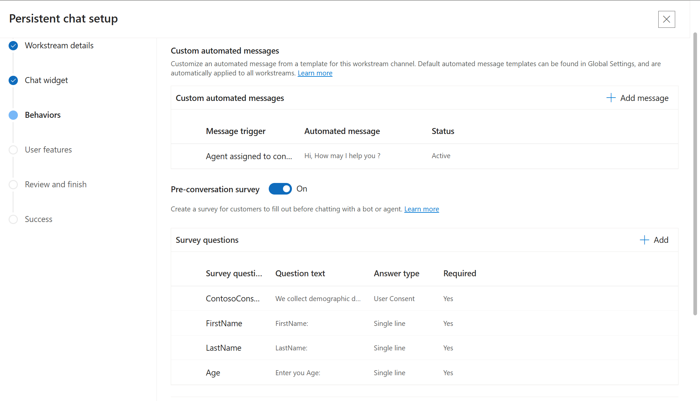

# Lab 15 - Configure a chat widget in Dynamics 365 Customer Service

**Objective** - In this Lab, you will configure a chat widget in Dynamics 365 Customer Service

1.  Switch back to Customer Service admin center, select **Channels** in **Customer support**.
    The **Channels** page appears.

    

2.  Select **Manage** for **Chat**. The **Chat channels** page appears.

    

3.  Select **Add chat channel**.

    

4.  On the **Channel details** page,

    - Name – **Contoso Chat Widget**

    - Language – **English – United States**

    - Select **Next.**

    

5.  On the workstream details page.

    - Select **Add to Existing Workstream**

    - Select **Contoso Chat Workstream**

    - Select **Next**

    

6.  On the **Chat Widget** page, leave the details as it is. Enable the
    **Proactive chat** toggle to **Yes.** Select **Next.**

    

7.  On the **Behaviors** page, under **Custom automated messages** –
    Select **Add a message**

    

8.  On **Add automated message** pane, select a trigger – **Agent
    assigned to conversation** from the **Message trigger** dropdown
    list.

9.  In the **Automated message** box, type the message – **Hi, how can I
    help you?** to be displayed.

10.  Select **Confirm**.

     

      

11.  Enable the **Pre-conversation survey.** Select **Add**

12.  Enter the details

     -  **Survey question name:** ContosoConsent

     - **Question text**: We collect demographic data. Please confirm
      whether you agree to provide the basic information.

     - **Answer type –** User consent

     - **Required -** Yes

     - Select **Confirm**.

     

13.  Select **Add** again

     - **Survey question name:** FirstName

     - **Question text**: FirstName

     - **Answer type –** Single line

     - **Required -** Yes

     - Select **Confirm**.

     

14.  Select **Add** again

     - **Survey question name:** LastName

     - **Question text**: LastName

     - **Answer type –** Single line

     - **Required -** Yes

     - Select **Confirm**.

     

15.  Select **Add** again

     - **Survey question name:** Age

     - **Question text**: Enter your Age

     - **Answer type –** Single line

     - **Required -** Yes

     - Select **Confirm**.

     

     

16. Set the toggle for **Post-conversation survey** to **Off**.

**Note - Authentication settings** option is enabled by default. Select
drop-down under **Authentication name** and select **Create
authentication setting.** The steps outlined below can be performed only
upon acquiring a paid license for Power Pages so that the custom
certificates can be uploaded to acquire a public Key URL.

A Chat widget is then created. You can click on **Cancel** for this lab
as we have explored how to create a chat widget in Customer Service
Trial.

**Summary** - You have configured a **Contoso Chat Widget** in Dynamics 365 Customer Service.

