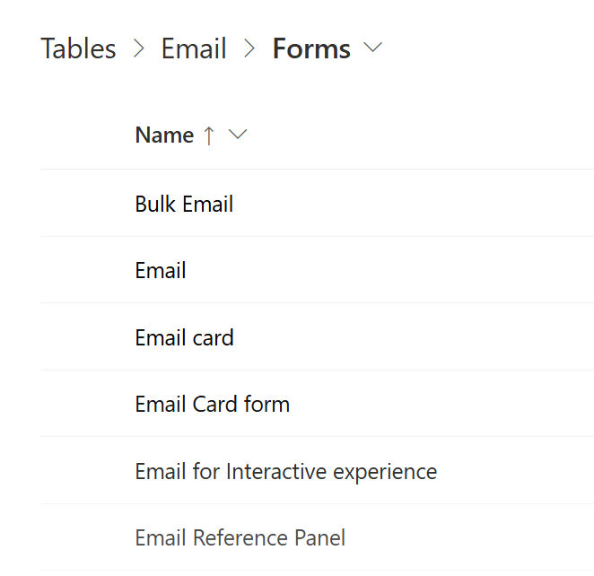
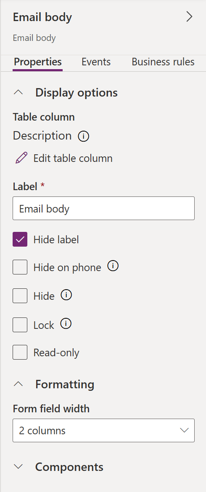
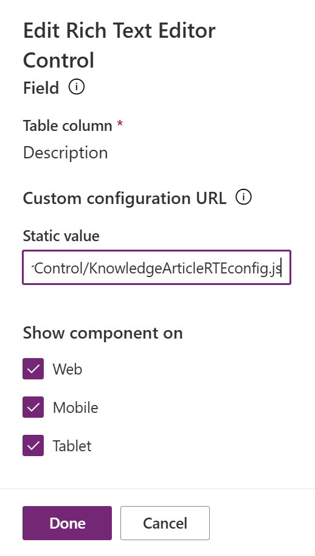

# Lab 18 - Add a knowledge article rich text editor control to a form

**Objective** - In this Lab, you will be adding a knowledge rich text editor to a form.

1.  Open a tab in the browser, paste the Power Apps URL –
    !!https://make.powerapps.com!!

2.  Login with the credentials provided to execute the lab.

3.  Change the environment to **Customer Service Trial** on the top
    right corner of the power platform home page.

    

4.  Select **Tables** on the left navigation pane.

    

5.  Select **Email** table.

    

6.  Select Forms under **Data experiences**.

    

7.  Select **Email**.

    

8.  Double click on the Email body to open the properties on the right
    hand side.

    

9.  Expand **components** by scrolling down.

    

10. For **Rich Text Editor Control** component, select the three
    vertical dots and then select **Edit**.

    

11. Paste the below text under static value -
    **webResources/msdyncrm\_/RichTextEditorControl/KnowledgeArticleRTEconfig.js**

    

12. Select **Done**, and then select **Save and Publish**.
