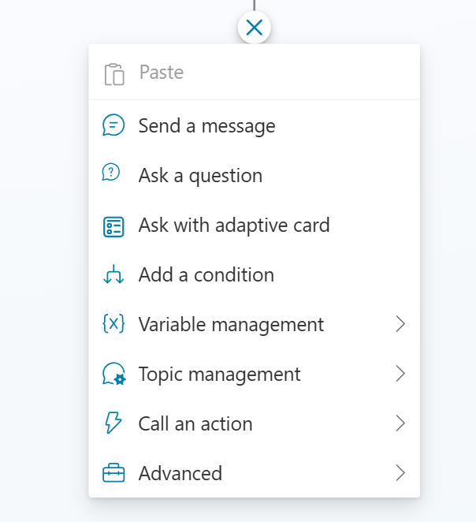

# Integrate knowledge management in Dynamics 365 with Copilot Studio bots

## Exercise 1 – Create a Copilot Bot

1.  Open a tab in the browser and go to the Copilot Studio home page -
    <https://copilotstudio.microsoft.com/> . Login with the credentials
    provided to execute the lab.

2.  Select the Environment as **Customer Service Trial** on top right
    corner of the homepage

3.  Select **Agents** in the left navigation.

> 

4.  Select **+ New agent**.

5.  Select **Skip to configure**

6.  Select **Create**.

7.  Your Agent is created.

## Exercise 2 - Create a Topic in Copilot Studio Bot

1.  For better visibility, close the **Test your agent** panel for now.

2.  On the top menu bar, select **Topics**.

3.  Select **Add a topic** and select **From blank**.

4.  Click on **Allow** if you are asked that copilot wants to access
    images and text.

A **Trigger** node appears on an otherwise blank topic authoring canvas.

5.  Select the **More** icon (**…**) of the **Trigger** node, and then
    select **Properties**.

6.  The **On Recognized Intent properties** panel appears. In this
    panel, select the **Phrases** box.

7.  The **Phrases** secondary panel appears. Under **Add phrases**, Add
    the trigger phrase and click on plus icon. Enter the below phrases.

    - Store hours

    - What time do you open

    - Is the store open today

    - Are you open on Sunday

    - Hours of operation

8.  Your agent needs 5 to 10 trigger phrases to train the AI model to
    understand your customers' responses. To add more trigger phrases,
    you can either:

    - Select the **Add** icon  next to the text
      field and enter the desired phrase.

    &nbsp;

    - Enter a phrase and select **Enter**.

Note - You can include punctuation in a trigger phrase, but it's best to
use short phrases rather than long sentences.

9.  Select **Details** on the toolbar to open the **Topic
    details** panel. Enter the name of the Topic as **Store hours**.

10.  Select **Save**.

The exercise outlined below can be performed only upon acquiring a paid
license for Customer Service.

## Exercise 3 - Use the Search Dynamics 365 knowledge article flow action

### Task 1 - Set connection references

To set connection references:

1.  Open a new tab and navigate
    to [make.powerapps.com](https://make.powerapps.com/).

2.  Select **Customer Service Trial** environment on the top right corner of
    the home page.

6.  Select **More** from the left navigation and then select **Connections**.

    
  
8.  Select **New connection**.

   

10.  Search for **Dataverse** and then select **Microsoft Dataverse**.

     

12.  Sign in and then select **Create**. Sign in with your credentials if prompted.

     

14.  Select **New connection**.

   

10.  Search for and select **Content Conversion**.

     

12.  Sign in and then select **Create**. Sign in with your credentials if prompted.

     

     

15.  From the left navigation of the Power Apps portal, select **Solutions** and then select **Default Solution**.

     

16.  From the left navigation, select **Connection references** and then select **Microsoft Dataverse CDS Connection**.

     

12. In the edit box that opens, select the connection that you created from the **Connection** dropdown menu.

     
   
14.  Select **Save**.

     

16.  Similarly select **Content Conversion**.

     

18.  In the edit box that opens, select the connection that you created from the **Connection** dropdown menu.

     

7.  Select **Save**.

    

9.  Go back to **Default Solution** \> **Cloud flows** and turn
    on **Search Dynamics 365 knowledge article flow** flow.

     

### Task 2 - Add the action to the Copilot Studio topic.

Perform the following steps to ensure that flow is properly configured
and can now be replaced with **Search Dynamics 365 knowledge
articles** action.

1.  Switch back to Copilot Studio portal

2.  On the agent page navigate to page where you created a topic –
    **Store hours**

3.  Within the topic, create a question node to ask the user to search
    for the input text.

4.  Create a question node for the filter and provide the sample filter
    value after you trigger the topic.

5.  Select **Add node** (**+**) and select **Call an action**.

6.  Select **Search Dynamics 365 knowledge article flow** action.

7.  Provide the input to the flow. An error might appear if the filter
    isn't provided to the flow.

8.  Add a message node to show the results returned by the flow. More
    information: [Render
    results](https://learn.microsoft.com/en-us/dynamics365/customer-service/administer/integrate-KM-with-PVA?context=%2Fdynamics365%2Fcontact-center%2Fcontext%2Fadminister-context#render-results)

9.  Select **Save**.

10. Use the trigger phase and run the topic to verify the flow.

** Tip**

If your search doesn’t return any results, modify the search terms or
filter conditions. You can also add a filter condition if required.

11. After the topic is configured, replace the **Search Dynamics 365
    knowledge article flow** with the **Search Dynamics 365 knowledge
    articles** action. You can now configure any bot in the organization
    to access knowledge articles using the **Search Dynamics 365
    knowledge articles** action.

12. Remove the filter question node. More information: [Work with
    filters](https://learn.microsoft.com/en-us/dynamics365/customer-service/administer/integrate-KM-with-PVA?context=%2Fdynamics365%2Fcontact-center%2Fcontext%2Fadminister-context#work-with-filters).

13. Update the message node with the output from the action and
    select **Save**.
