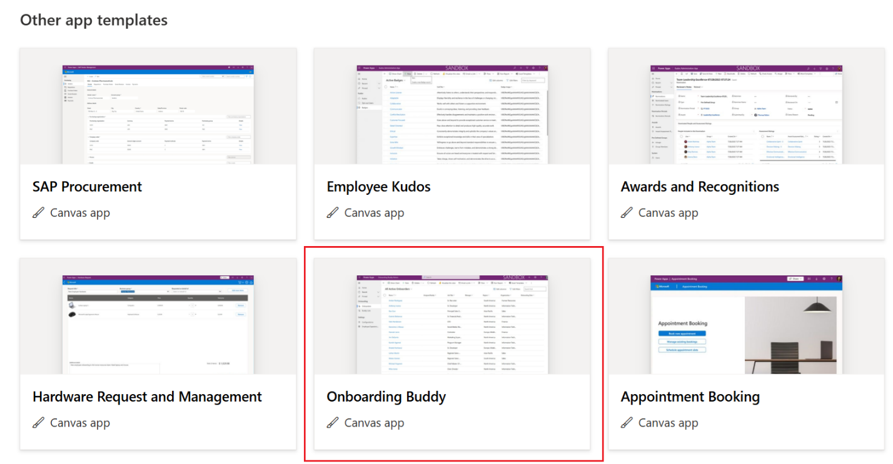
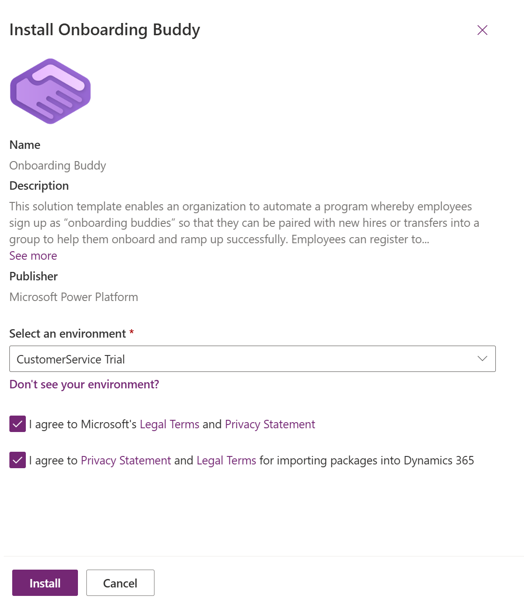
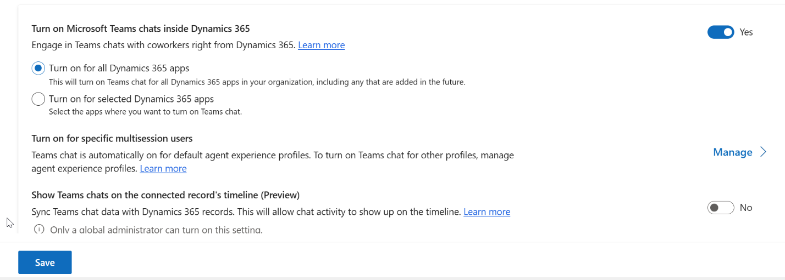

# Configure Microsoft Teams chat in Customer Service

## Task 1 – Install a template-based app in Power Apps.

1.  Login to Power Apps Portal - <https://make.powerapps.com/> . Login
    with the credentials provided to execute the lab

2.  Select the Customer Service Trial Environment on the top right
    corner of the home page.

3.  Select **Start with the Template**

4.  For this lab, select **Onboarding buddy** template

5.  Select **Get it Now** from the AppSource site.

6.  Sign in with your credentials provided to you to execute the lab.

7.  Select **Get it Now**

8.  You will be navigated to the Power Platform Admin Center site
    install the app. Select the environment by agreeing to the terms and
    select **Install**.

9.  The app installation will approximately take 10-15 minutes. You need
    to wait until the installation is complete. You can refresh the page
    to check the latest status.

## Task 2 - Add the Teams collaboration and chat settings page to the sitemap of your app

1.  Navigate back to Home page of Power Apps home page.

2.  Select the environment, and then select **Apps**.

3.  Select your custom app – Onboarding Buddy, and then select **Edit**.

4.  Select **three horizontal dots (…) \> Switch to Classic**

5.  In the **App Designer**, edit the **Sitemap**. Select **Add \>
    Subarea**

6.  To add the Teams **Chat and collaborate** settings page, in the
    subarea component, and then for the **Type**, select **URL**.

7.  Copy the following value and paste it into URL field:  
    /main.aspx?pagetype=control&controlName=MscrmControls.TeamsCollaborationAdmin.TeamsCollaborationAdmin

8.  Save and publish the changes.

## Task 3 - Access the Teams settings

1.  In the site map of Customer Service admin app, in **Agent
    experience**, select **Collaboration**.

2.  In **Embedded chat using Teams**, select **Manage**.

3.  On the **Microsoft Teams collaboration and chat** page, turn on the
    toggle for **Turn on Microsoft Teams chats inside Dynamics 365**.

4.  Select the option - **Turn on for all Dynamics 365 apps** 

&nbsp;

1.  **Save** the changes.

> 

## Task 4 – Setup Join a Teams call in agents

By default, the Join a Teams call feature is turned on out of the box in
Customer Service workspace for agent profiles that have Omnichannel for
Customer Service enabled.

1.  In Customer Service admin center or Contact Center admin center, go
    to **Agent experience** \> **Collaboration**.

2.  In **Join a Teams call**, select **Manage**.

3.  On the **Join a Teams call** page, turn on the setting for **Join a
    Teams call**.

