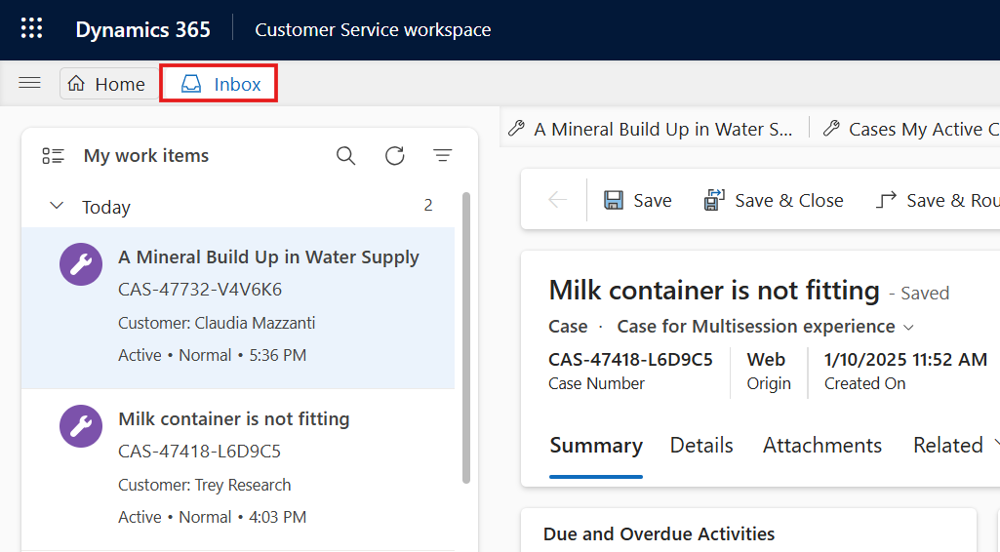
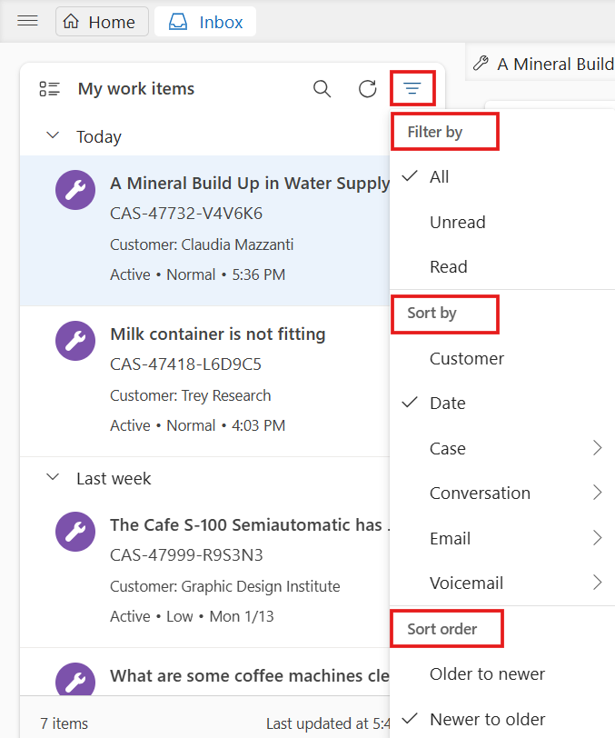
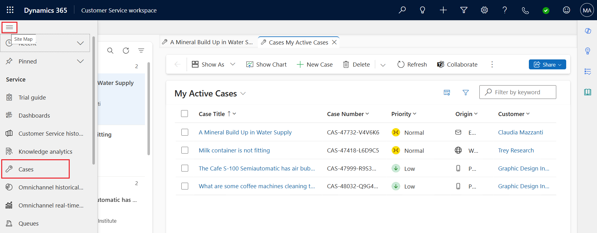
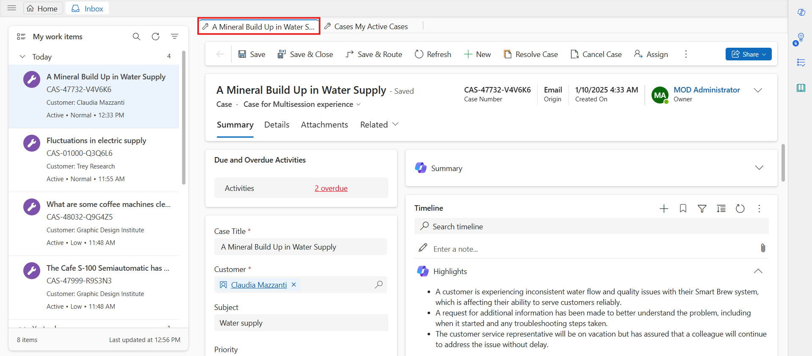
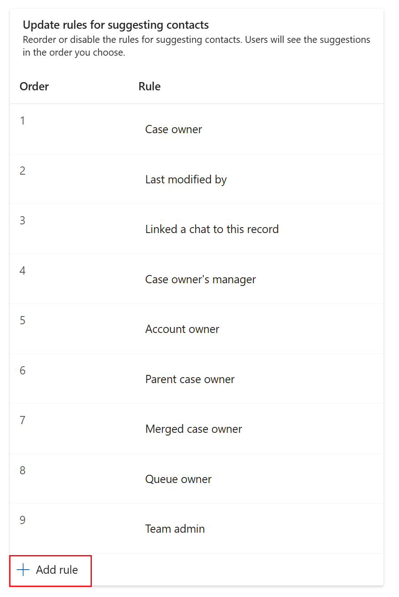
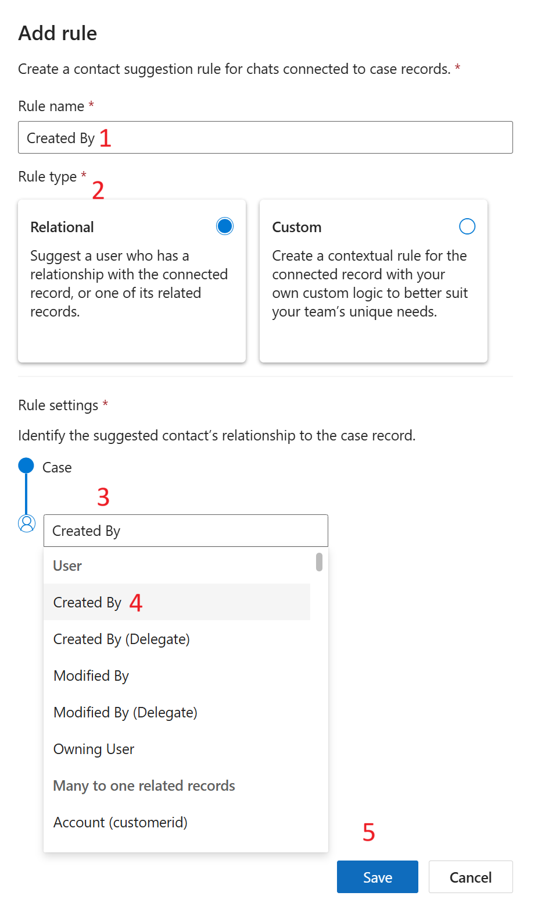

# Configure rules-based suggestions for contacts in Microsoft Teams

## Exercise 1 - Turn on the suggested contacts for a record type

### Task 1 - To enable collaboration with Microsoft Teams and chat

1.  In the site map of Customer Service admin center or Contact Center
    admin center, in **Agent experience**, select **Collaboration**.

> 

2.  In **Embedded chat using Teams**, select **Manage**.

3.  On the **Microsoft Teams collaboration and chat** page, set the
    toggle for **Turn on the linking of Dynamics 365 records to
    Microsoft Teams channels** to **Yes**.

4.  To get suggested contacts for any record type, perform the following
    steps:

    1.  In **Connect chat to Dynamics 365 records**, select record type-
        **Case** which we want to enable rules-based suggested contacts.
        The relative settings pane appears on the right.

    2.  In **Suggest contacts**, turn on the toggle for **Rules-based
        suggested contacts**.

    3.  Select **Save**

5.  In the **Update rules for suggesting contacts** section, reorder or
    disable the rules for suggesting contacts. Users see the suggestions
    in the order we choose.

    - To reorder the rules, hover over a rule, and then select the up or
      down arrow to move the rules up or down, respectively.

    &nbsp;

    - To disable a rule, hover over a rule, and then
      select  . When the rule is disabled, a
      check mark is displayed when you hover over the disabled rule.

    &nbsp;

    - To delete a rule, hover over the rule, and then
      select  . Deleting a rule removes it
      entirely so it won't influence suggested contacts in the future.

6.  Select **Save**.

## Exercise 2 - Adding a new rule

1.  On the settings pane, in the **Update rules for suggesting
    contacts** section, Select the 4^(th) rule that says – **Updates a
    timeline activity.** Delete the rule.

> 

2.  select **+** **Add rule**.

3.  The **Add rule** pane is displayed for the record type you selected.

4.  Enter the information as mentioned below.

    - **Rule name** - Created By

    - **Rule Type** - Relational

    - **Select a user or related record** – Created By

    - Select **Save**

5.  A new rule is created. Select **Save** again.

6.  Select **Save** on **Microsoft Teams collaboration and chat**

> 
