# Lab 24 – Create a Case and view AI-suggested similar cases and knowledge articles

**Objective** - In this lab, you will create Cases, associate cases as parent and child, convert a case to a Knowledge article and view AI-suggested similar cases and knowledge articles.

## Task 1: Enable enhanced case forms for multisession apps

1.  Select the **App selector** from the top ribbon.

    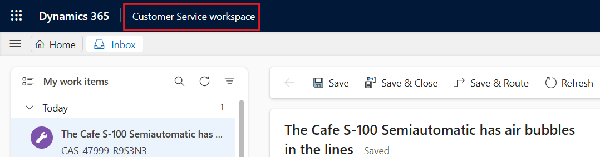

2.  Select **Copilot Service admin center** from the **Apps** page.

    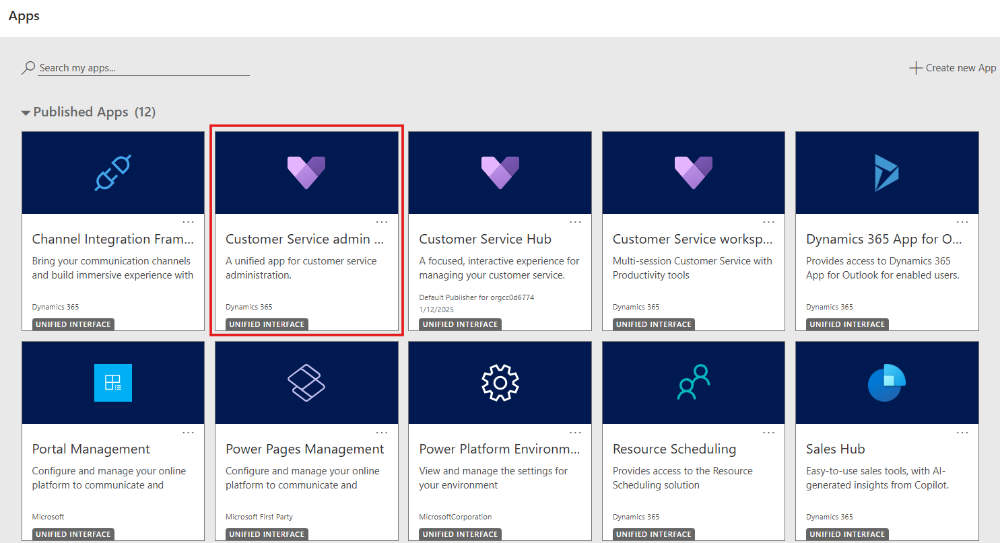

3.  On the left navigation in Copilot Service admin center,
    select **Case Settings**.

4.  Select **Manage** for **Enhanced case experience**.

    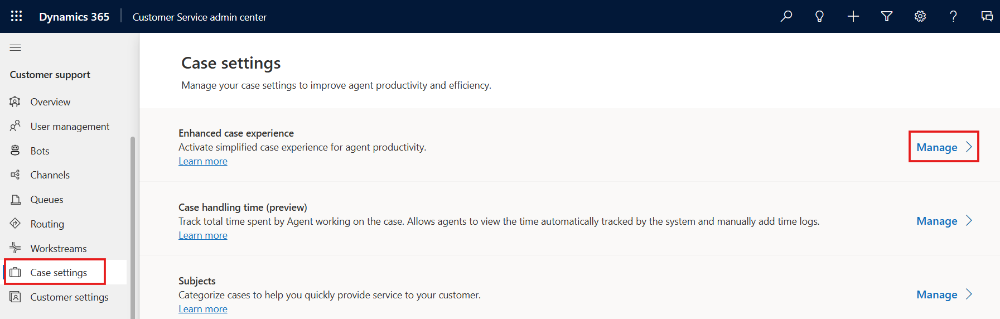

5.  Switch the **Enhanced case experience** toggle to **Yes**.

    - To enable the enhanced full case form:

        1.  Set the **Full case form** toggle to **Yes**, for your agents
          to see the enhanced full case form when they create a new
          case.

        2.  Select **Configure** to customize the form in Power Apps. The
          Power Apps form page opens on a new tab.

    

6.  The Enhanced full case form will be opened in the Power Apps tab.
    You can edit the form as per your requirements.

    

7.  Switch back to the **Copilot Service admin center** tab. To enable
  the enhanced quick case form:

8.  Switch the **Quick case form** toggle to **Yes**.

9.  Select the option in the **Choose Form** dropdown. The selected
      main form appears as the side pane when the agent creates a new
      case. By default, this is set to **Enhanced quick case form**.

    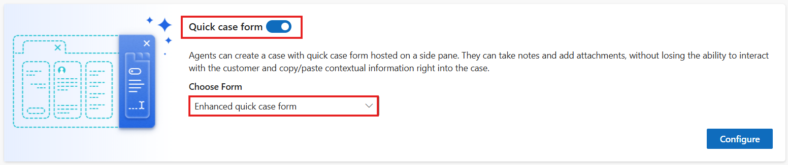

10.  Select **Configure** to customize the form in Power Apps. The Power
    Apps form page opens on a new tab.

    **Note**: Do not close the tab.

        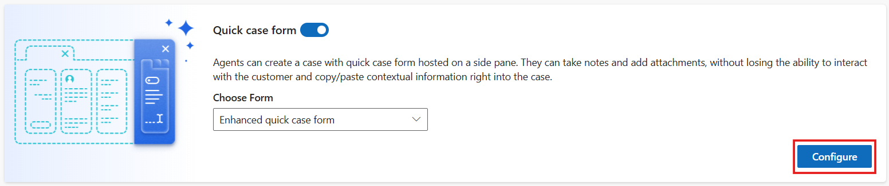

## Task 2: Create a case

1.  Select the **App selector** from the top ribbon.

2.  Select **Copilot Service workspace** from the **Apps** page.

    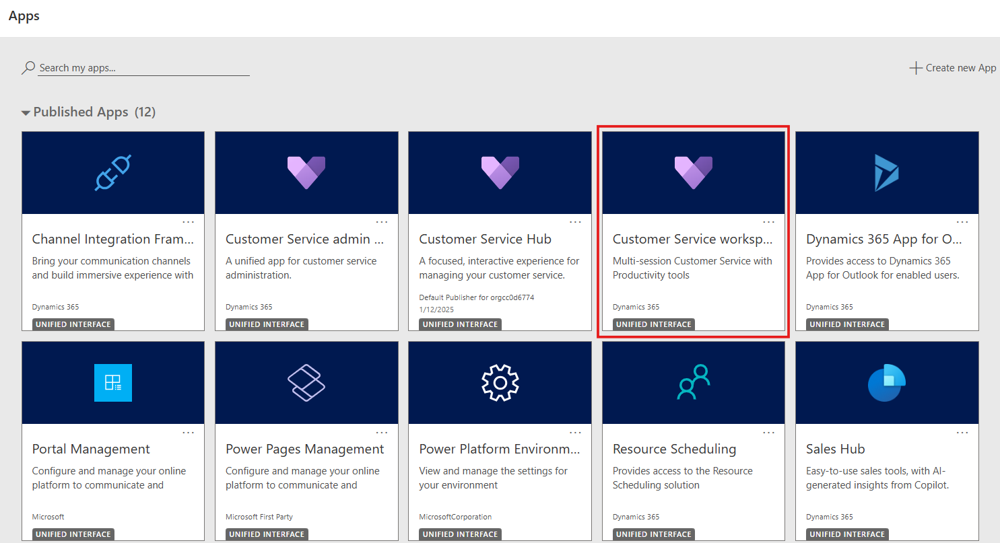

3.  In the Copilot Service workspace, select the **Site Map** and then
    select **Cases**.

    

4.  The **My Active Cases** view is displayed. You can switch between
    the different case views by selecting the current view.

    

5.  Select **Show Chart** on the command bar to see the chart view.

    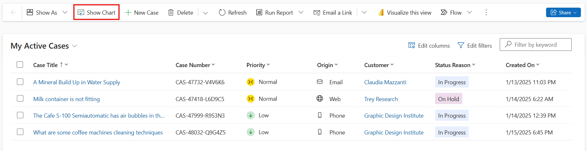

6.  Select the three dots on the command bar and then select **Open
    Dashboards**.

    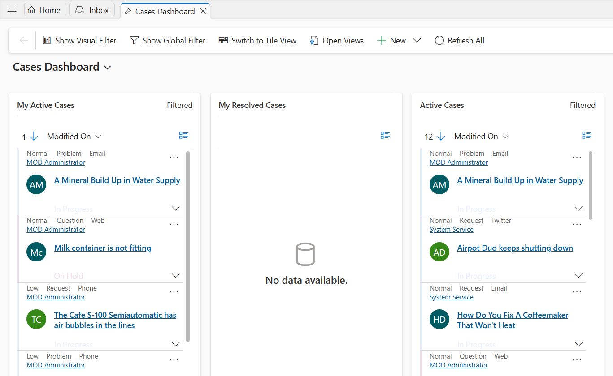

8.  To switch back to views, select **Open Views**.

    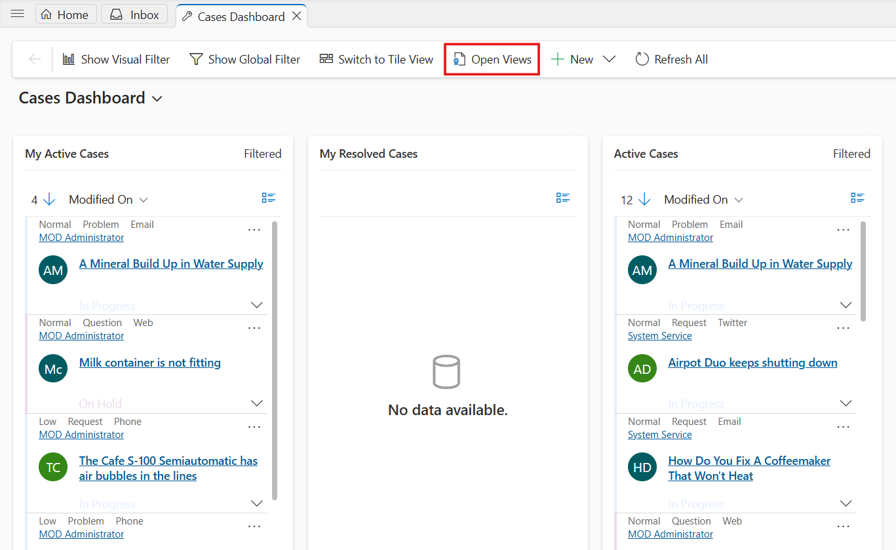

9.  If you select a case record from the case view, you see these
    additional options on the command bar:

    - **Save & Route**

    - **Resolve Case**

    - **Cancel Case**

    - **Assign** 

    - **Add to Queue** 

    - **Queue Item Details**

    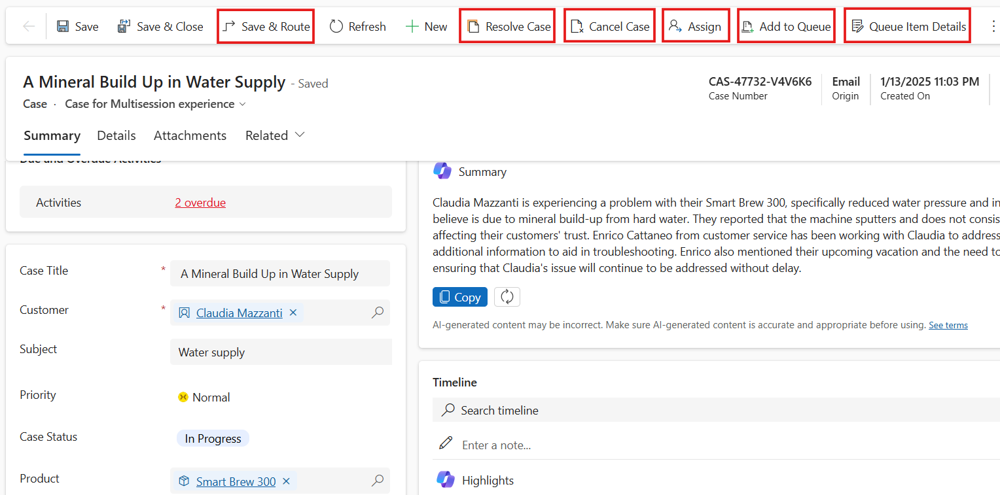

10.  Switch back to the **My Active Cases** tab and select **New Case**.

        

11.  Enter the following information on the **Summary** tab and then select **Save**.

        - **Case Title** – !!Minerals level is not maintained!!
   
        -  **Customer** – Trey Research

        - **Subject** – !!Water supply!!

        - **Priority** – Normal
   
        - **Case Status** - In Progress
   
        - **Product** – !!Water Filtration System!!

        

12. Select the **Details** tab and enter the following information and then select **Save**.

   -  **Type** – !!Problem!!

## Task 3: Create a child case

1.  On the command bar, select the three dots and then select **Create
    Child Case**.

    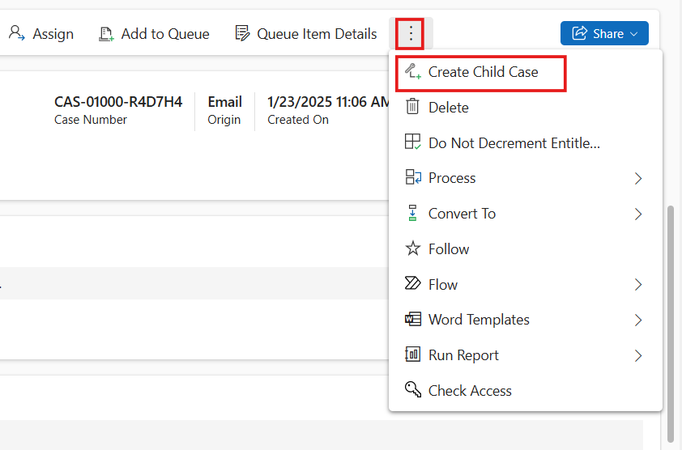

2.  On the **Quick Create: Case** pane that appears on the right side, enter the
    following information and then select **Save and Close**.

    - **Case Type** – !!Request!!

    - **Customer** – !!Trey Research!!

    - **Case Title** – !!Share a quotation for replacement!!

3.  Select **Save & Close**.

4.  Select **Details** tab from the command bar and then scroll down.

5.  You will view the **Child case** on the **Child Cases** tile.

    

6.  Select **Save & Close**.

## Task 4: Associate cases as parent and child

You can set a parent-child relationship between cases where you can set
one case as parent and set other cases as its child cases.

1.  Switch back to **My Active Cases** tab, select two or more cases
    that you want to associate as parent and child cases.

2.  On the command bar, select **Associate Child Cases**.

    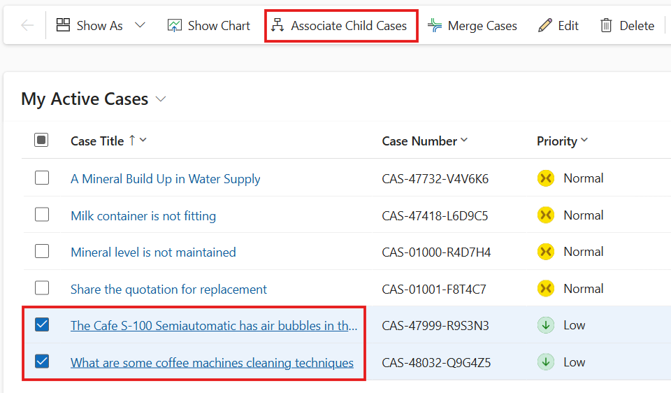

3.  The **Set Parent Child Relationship** dialog appears.

4.  In the list, select the case that you want to set as parent, and
    then select **Set**.

    

5.  Select **OK**.

    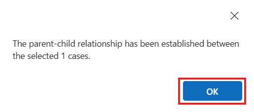

6.  Select the case that was selected as a Parent case by you.

7.  Select **Details** tab from the command bar and then scroll down.

8.  You will the Child case on the **Child Cases** tile.

    

## Task 5: Convert a case to a Knowledge article

1.  Switch back to **My Active Cases** tab and open a case that has the
    information that you want to convert to a knowledge article.

2.  On the command bar, select the ellipsis **(...)** and go
    to **Convert To** \> **To Knowledge Article**.

    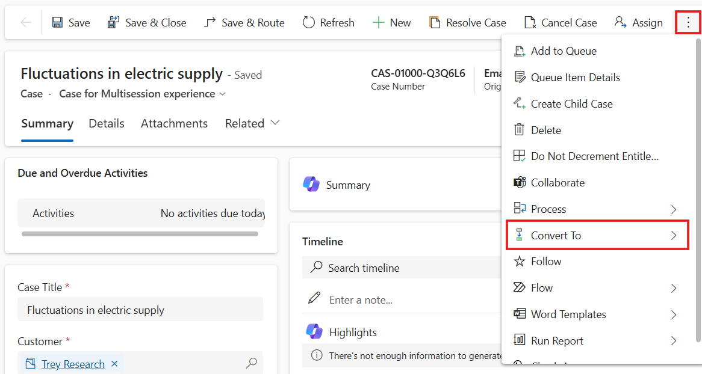

    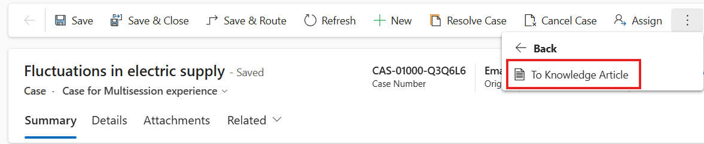

3.  On **Convert to knowledge article** page, keep the default values
    and then select **Convert**.

    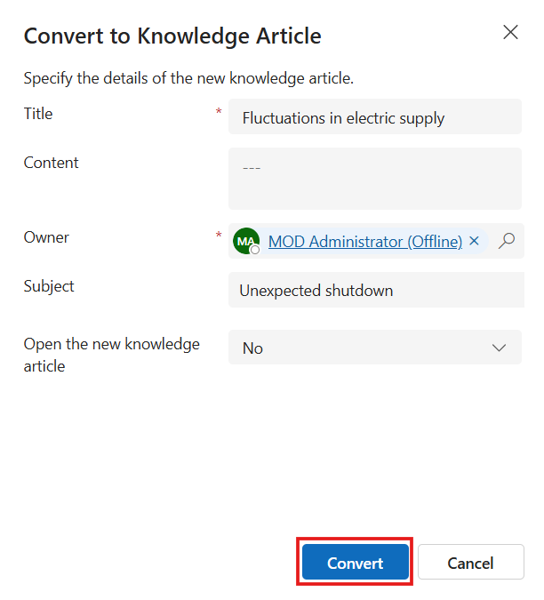

4.  The knowledge article is created.

## Task 6: View AI-suggested similar cases and knowledge articles

1.  On Copilot Service Workspace, select the **Home** tab and then
    select **Copilot Service Agent Dashboard**.

    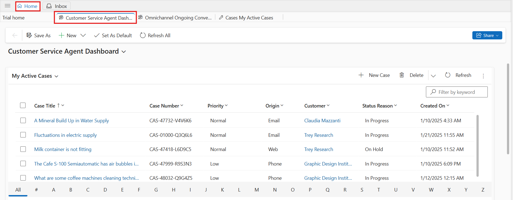

2.  In the **My Active Cases** list, select the **A Mineral Build Up in Water Supply** case. The case opens in a
    session tab. Select **Smart assist** tab from the right bar.

3.  The **Smart assist** pane lists the knowledge articles and similar cases suggested by AI based on the case context.

4.  In the **Knowledge article suggestion** area, do any of the
    following:

    - Select an article title to go through and get relevant information. The selected knowledge article opens in a new application tab.

5.  Select more commands to do the following:

    - **Email Content:** Select to open the email compose form with the
    contents of the knowledge article pasted in the mail body.

6. Select the link icon to associate the article with the case as a
  related article.

7.  In the **Similar case suggestions** area, do any of the following:

    - Select a case title to drill through the details of the resolved case.

    - Select more commands to do the following:

    - **Copy resolution:** Select to copy the resolution notes information from the resolved case to the clipboard.

    - **Email agent:** Select to open the email compose form to send your questions to the agent who handled the similar case. The mail form opens on a new tab with the pertinent information and link to the resolved case filled in.

8. Select the link icon to link or clear the link with the similar case.

**Summary** - You have created Cases, associated cases as parent and child, converted a case to a Knowledge article and viewed AI-suggested similar cases and knowledge articles.
