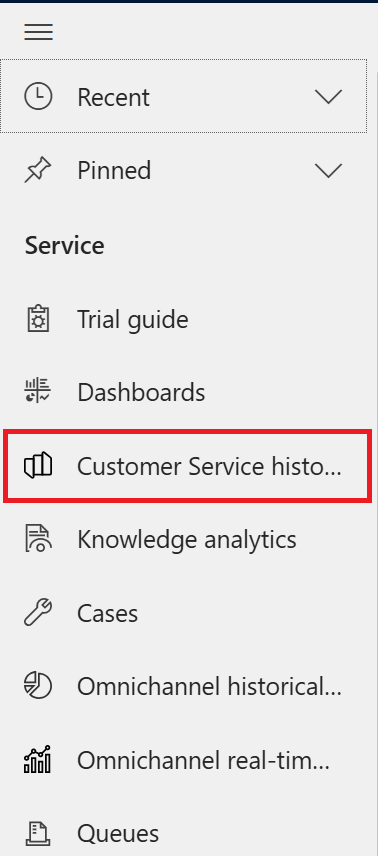

# Lab 25 - Using Omnichannel historical analytics dashboard and Customer Service historical dashboard

## Task 1 - Omnichannel historical analytics dashboard

1.  Switch back to Customer Service Admin Trial tab. If you have closed
    the tab. Navigate to Power Platform Admin center \> Environments \>
    Select your environment\> Select the environment URL.

2.  Click on **Customer Service admin center** to list the available
    apps.

3.  Select **Customer Service workspace.**

4.  Select three horizontal lines to view the navigation pane.

5.  Select **Omnichannel historical analytic -Insights**.

6.  The Dashboard is displayed accordingly.

You have tabs for each category – **Conversation, Queue, Agent, Bot and
Topics.** You can click on each tab to explore each category.

-    **Conversation** - The Conversation dashboard gives you a broad overview of the customer service experience in your organization. It uses AI to surface insights into the topics that generate the highest volume and the topics that are emerging with the fastest increase in volume.

Conversation dashboard in Omnichannel for Customer Service.

The dashboard includes various charts with graphical views of your organization's key performance indicators (KPIs).

-    **Queue** - The Queue dashboard gives you a broad overview of the customer service experience in your organization by providing insights into how specific queues are operating.

-    **Agent** - The Agent dashboard shows charts and KPIs that you can use to guide agents and understand overall agent performance.

-    **Bot** - The bot dashboard shows key performance indicators (KPIs) and charts for chat and IVR bots. You can use the dashboard to understand how bots are performing in a support organization.

-    **Topics** - The Topics dashboard shows a detailed breakdown of conversations and their assigned topics. 

## Task 2 - Customer Service historical analytics - Insights Dashboard

1. Select the three horizontal lines and select **Customer Service
historical analytics – insights**

2. The dashboard is displayed. You have tabs for each category – Summary, Agent and Topics. You can click on each tab to explore each category.

-    **Summary dashboard** - The summary dashboard includes various charts with graphical views of key performance indicators (KPIs) in Customer Service.

  
-    **Agent dashboard** - The Agent dashboard shows charts and KPIs that you can use to guide agents and understand overall agent performance.

  
-    **Topics dashboard** - The Topics dashboard shows a detailed breakdown of cases and their assigned topics.

