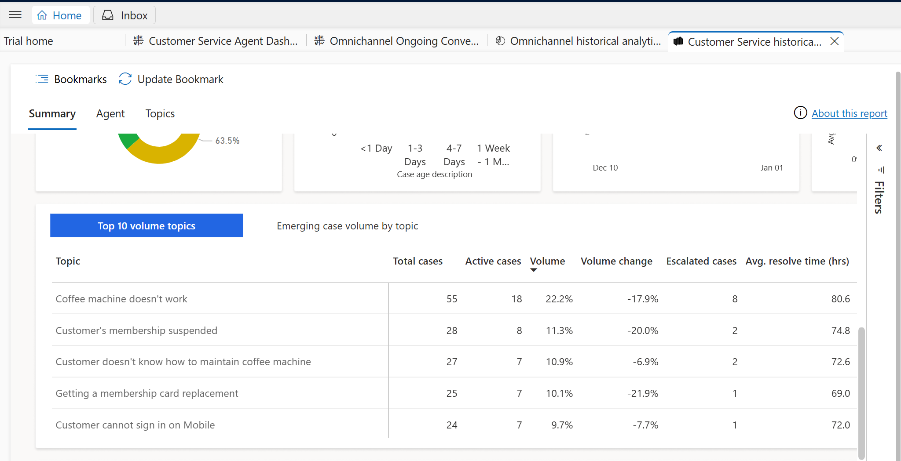
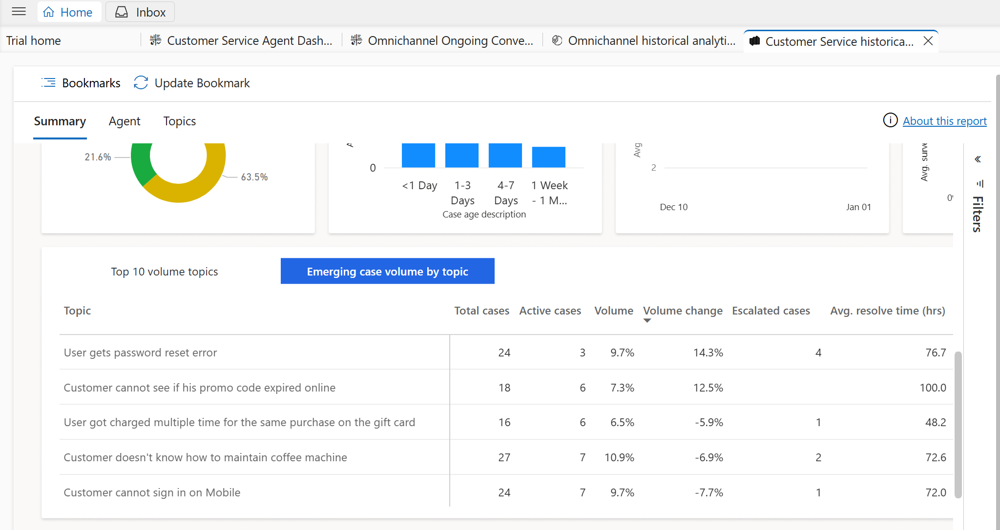

# Lab 25 - Using Omnichannel historical analytics dashboard and Customer Service historical dashboard

## Task 1 - Omnichannel historical analytics dashboard

1.  Switch back to Customer Service Admin Trail tab. If you have closed
    the tab. Navigate to Power Platform Admin center \> Environments \>
    Select your environment\> Select the environment URL.

2.  Click on **Customer Service admin center** to list the available
    apps.

3.  Select **Customer Service workspace.**

4.  Select three horizontal lines to view the navigation pane.

5.  Select **Omnichannel historical analytic -Insights**

6.  The Dashboard is displayed accordingly.

You have tabs for each category – **Conversation, Queue, Agent, Bot and
Topic.** You can click on each tab to explore each category.

**Conversation**

**Queue**

**Agent**

**Bot**

**Topics**

## Task 2 - Customer Service historical analytics - Insights Dashboard

Select the three horizontal lines and select **Customer Service
historical analytics – insights**

The dashboard is displayed

### Key Insights discovered

The Key Insights discovered section has two areas:

- **KPI insights**: Important subjects that impact performance, such as
  CSAT pertaining to priority, volume pertaining to channel, and open
  cases pertaining to queues.

- **Topics to watch**: Topics that rank high across the three key areas
  to make it easier for customer service managers to discover top
  issues.

### Report details

The KPI summary charts summarize the key performance indicators for the
specified time period and the percent change over the period. You can
filter these areas by duration, channel, queue, and agent.

The case lifecycle and the metrics that can be derived in the different
statuses is represented in the following diagram.

The following table shows the key performance indicators that are
displayed in the report.

[TABLE]

The following metrics are displayed in the charts.

[TABLE]

Please scroll down further to view the top 10 volume topics

On the **Emerging case volume by topic** tab, you can view the top
emerging AI discovered topics based on increase in case volume.

You can view the core case metrics by channel or core case metrics in
relation to other metrics and date.

