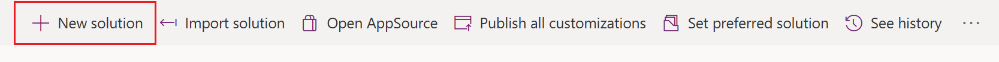
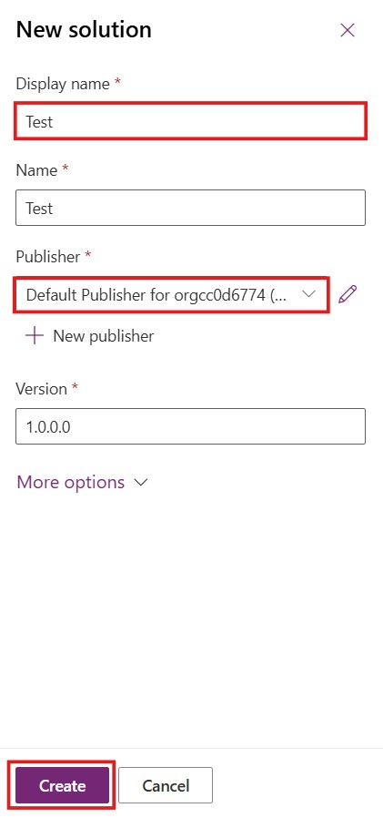
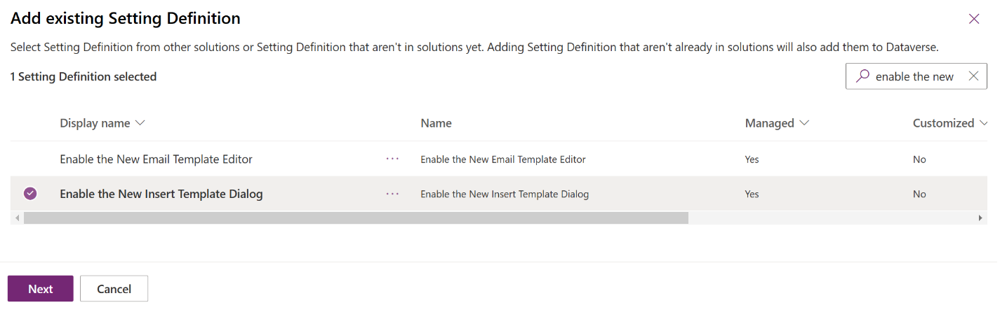
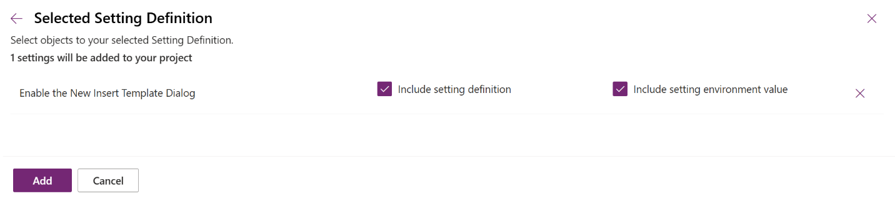
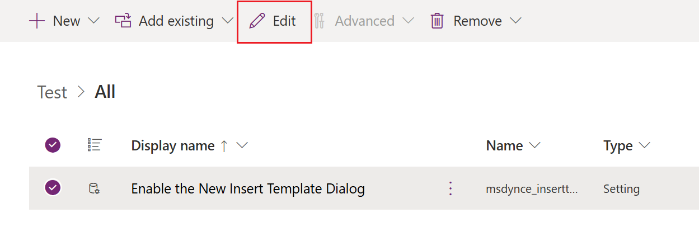

# Lab 26 - Configure the enhanced insert email template selection dialog

**Objective** - In this lab, you will configure the enhanced insert email template selection dialog

## Task 1 - Enable the enhanced email selection dialog

1. Open a new tab in the browser, navigate to the Power
    Apps - https://make.preview.powerapps.com/, select the **Customer
    Service Trial** environment.

2. Select **Solutions** on the left navigation pane.

    

3.  Click on **New Solution**

    

4.  Enter the below details

    1.  **Display Name** of the solution – `Test`

    2.  **Publisher –** Default publisher for your organization

    3.  Select **Create**

      

5.  Select **Add Existing** \> **More** \> **Setting**.

      

6.  On the **Add existing Setting Definition** pane, search and select
    **Enable the New Insert Template Dialog** option and then
    select **Next**.

     

7.  Select **Add** on the **Selected Setting Definition**.

      

8.  The **Enable the New Insert Template Dialog** option is added to
    your solution. Select **Edit**.

      

9.  Set the **Setting environment value** option to **Yes** on
    the **Edit Enable the New Insert Template Dialog** pane. Select **Save**.    

      

      

11. Unselect and Select **Publish All Customizations**.

      

      

## Task 2 - Disable the enhanced email selection dialog for an app

For an app to display the default email template selection dialog, you
must disable the enhanced email template selection option. To disable
the option for a specific app, you must add the app to the Solution in
which you've added the email template selection option. Perform the
following steps:

1.  Go to **Add Existing** \> **App** \> **Model-driven app**

    

2.   On the **Add existing model-driven apps** pane. Select the app for
    which you want to disable the enhanced insert email template
    selection dialog. The app is added to the solution. For this lab, we
    are not selecting any app. Hence select **Cancel**

    

**Note** -

- Select the **Enable the New Insert Template Dialog** option in the
  solution.

- On the **Edit Enable the New Insert Template Dialog**, in
  the **Setting app value** section, the selected app is displayed.

- Select **New app value** for the app, and select **No** for the
  specified app.

- Select **Save** and **Publish All Customizations**.

**Summary** - You have successfully configured the enhanced insert email template selection dialog
