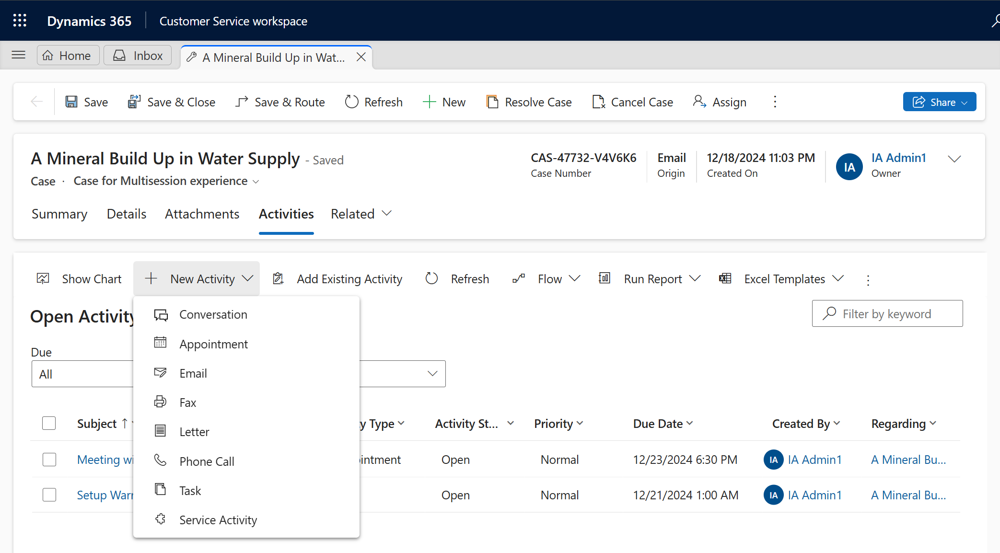
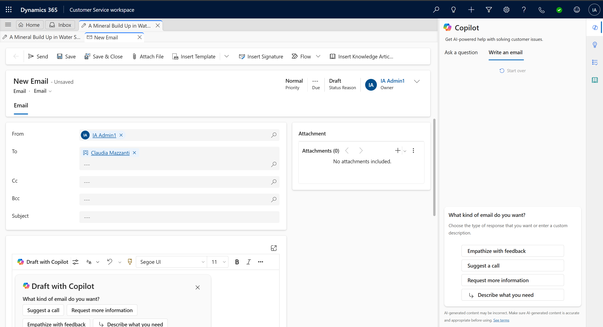
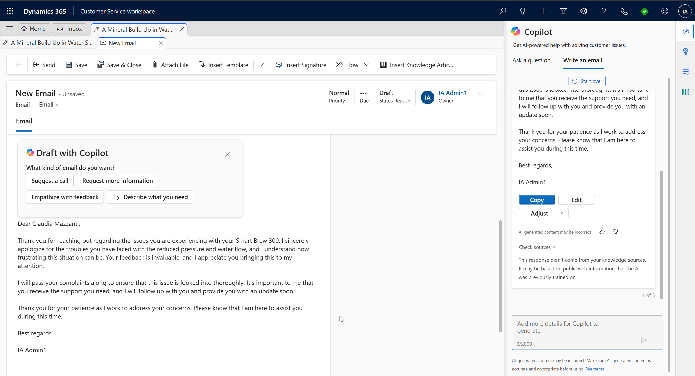

# Lab 27 - Use Copilot to solve customer issues faster with Dynamics 365 Customer Service

**Objective** - In this lab, you will use Copilot to summarize cases, draft email and questions.

## Task 1: Summarize cases

Copilot case summaries help you to quickly understand the context of a
case and resolve customer issues more efficiently. The case summary
includes key information such as the case title, customer, subject,
product, priority, case type, and description.

1. In the Copilot Service workspace, select the **Copilot Service Agent Dashboard**.

    

2. Select one of the cases listed on the **Copilot Service Agent Dashboard**.

    

3. The **Case summary** appears as a card on the case form. When you
    open a case, the **Summary** card is collapsed by default.

    

4.  Expand the **Summary** tab.

    

5.  You can see the generated case summary.

    

## Task 2: Draft emails

1.  Select **Write an email** tab on the **Copilot** pane.

    

2.  On the case overview page, select **Related** tab and then select
    **Activities.**

    

3.  Select **+New Activity \> Email**.

    

4.  When you start to draft an email, Copilot opens in the right-side  panel and presents five predefined prompts and one custom prompt:

    - **Suggest a call**: Drafts a reply that suggests a call with the
  customer today or tomorrow.

    - **Request more information**: Drafts a reply that requests more
  details from the customer to help resolve the problem.

    - **Empathize with feedback**: Drafts a reply that provides an
  empathetic response to a customer who expresses a complaint.

    - **Provide product/service details**: Drafts a reply that offers
  details or answers customer questions about a particular product or
  service.

    - **Resolve the customer's problem**: Drafts a reply that provides a
  resolution—and resolution steps, if applicable—to the customer's
  problem.

    - **Custom**: Allows you to provide your own prompt for the reply.

    

    

6.  Select **Empathize with feedback** from the predefined prompts list.

7.  You can see, **Copilot** has generated suggestion.

    

8.  You can now review the response. Make any necessary changes, and
    then select **Copy to email** to copy the entire response to your
    draft. Or select part of the response and use the right-click menu
    to copy and paste the selection.

    

9.  Response is now available in body part on left side.

    

10.  Now you can send the email or save it.

   

**Summary** - You used Copilot to summarize cases, draft email and questions.
