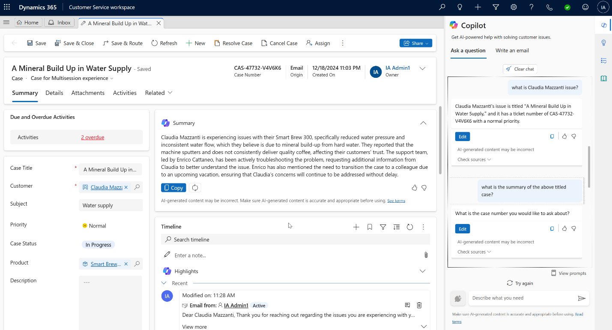
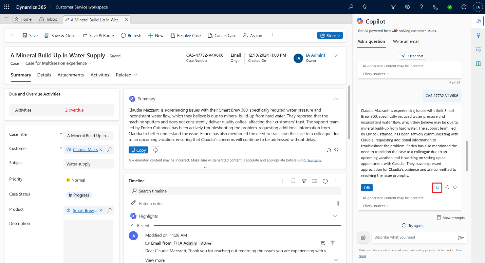
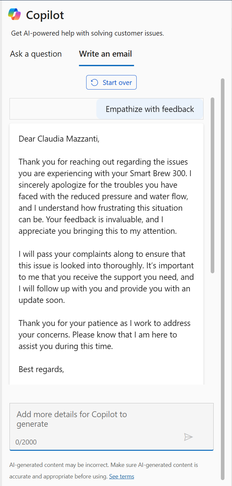

# Lab 27 - Use Copilot to solve customer issues faster with Dynamics 365 Customer Service

**Objective** - In this lab, you will use Copilot to summarize cases, draft email and questions.

## Task 1: Summarize cases

Copilot case summaries help you to quickly understand the context of a
case and resolve customer issues more efficiently. The case summary
includes key information such as the case title, customer, subject,
product, priority, case type, and description.

1. In the Customer Service workspace, select the **Customer Service Agent Dashboard**.

    

2.  Select one of the cases listed on the **Customer Service Agent
    Dashboard**.

    

3.  The **Case summary** appears as a card on the case form. When you
    open a case, the **Summary** card is collapsed by default.

    

4.  Expand the **Summary** tab.

    

5.  You can see the generated case summary.

    

## Task 2: Draft questions

You can ask free-form questions just as you'd ask your colleague or
supervisor who might know the answers.

1.  In the **Copilot** pane, which is opened on right side of the
    screen, type !!What is Claudia Mazzanti issue!! and select
    **Send** icon.

2.  You can now see that **Copilot** has answered your question.

    

3.  You can ask more questions like, !!what is the summary of the above
    titled case?!! and click on **Send** icon. Copilot will give
    response to your question.

    

4.  Enter the case number and view the copilot response

    

5.  If you're satisfied with the response Copilot provides, you can use
    the whole response or a part of it to answer the customer's
    question:

- Copy part of Copilot's reply into your chat or read from it during a
  voice conversation. Select the **Copy** icon to copy the entire
  response to the clipboard.

    

> **Note**: When you're in an active digital messaging conversation,
> select **Send to customer** to open an editing window where you can
> revise the response and send it to the customer. You can also change
> customer keywords to prompt Copilot to generate a more accurate
> response.

## Task 3: Draft emails

1.  Select “**Write an email**” tab on the **Copilot** pane.

    

2.  On the case overview page, select **Related** tab and then select
    **Activities.**

    

3.  Select **+New Activity \> Email**.

    

4.  When you start to draft an email, Copilot opens in the right-side
    panel and presents five predefined prompts and one custom prompt:

- **Suggest a call**: Drafts a reply that suggests a call with the
  customer today or tomorrow.

- **Request more information**: Drafts a reply that requests more
  details from the customer to help resolve the problem.

- **Empathize with feedback**: Drafts a reply that provides an
  empathetic response to a customer who expresses a complaint.

- **Provide product/service details**: Drafts a reply that offers
  details or answers customer questions about a particular product or
  service.

- **Resolve the customer's problem**: Drafts a reply that provides a
  resolution—and resolution steps, if applicable—to the customer's
  problem.

- **Custom**: Allows you to provide your own prompt for the reply.

    

    

5.  Select **Empathize with feedback** from the predefined prompts list.

6.  You can see, **Copilot** has generated suggestion.

    

7.  You can now review the response. Make any necessary changes, and
    then select **Copy to email** to copy the entire response to your
    draft. Or select part of the response and use the right-click menu
    to copy and paste the selection.

    

8.  Response is now available in body part on left side.

    

9.  Now you can send the email or save it.

    

**Summary** - You used Copilot to summarize cases, draft email and questions.
