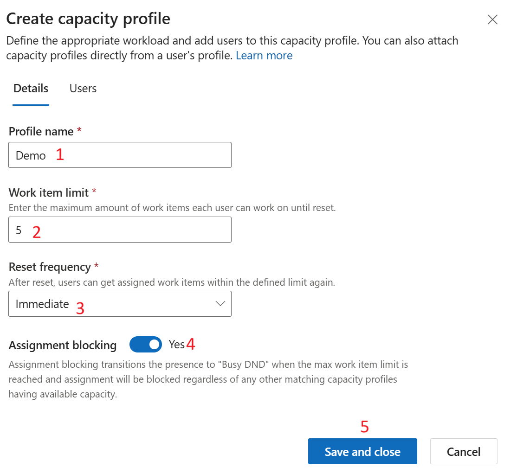

## Lab 3 - Create a capacity profile and assign to users

**Objective** - In this lab, you will create a capacity profile, you can add or remove users and edit any setting
except reset frequency. If you no longer require the profile, you can
delete it.

1.  On the Copilot Service admin center, select **User management** under **Customer support**.

    

2.  Select the **Manage** option for **Capacity profile**.

    

3.  On the **Capacity profiles** page, select **Create new**.

    

4.  On the **Details** tab of the **Create capacity profile** dialog
    box, enter the following details:

    - **Profile name**: Name for the capacity profile as `Demo`

    - **Work item limit**: Number of units of the work type that you can
      assign to the agent. – Enter - 5

    - **Reset frequency**: Period after which capacity consumption is
      reset for agents. Select **Immediate**

      **Note** - Once configured, you must recreate the capacity profile if
      you want to change the reset frequency.

    - **Assignment blocking**: Set the toggle to **Yes**. When the work item
      limit is met, the agent isn't assigned a new work item automatically.

    - Select **Save and Close**

    

5.  Select the capacity profile created. Select the **Users** Tab and Select
    **Add user**

    

6.  Select the admin user and **Add user**

    

7.  Select **Save and Close.** The capacity profile is assigned to the
    admin user.

    

**Summary** -  You successfully have created Capacity profile and assigned the administrator to the capacity
