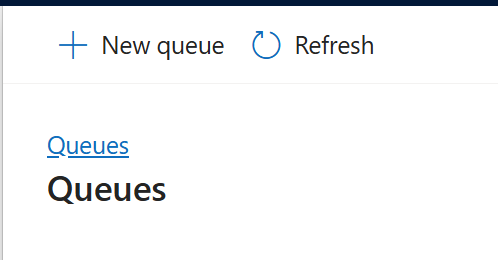
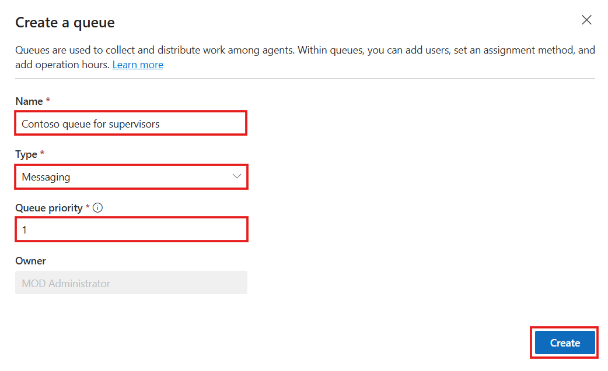
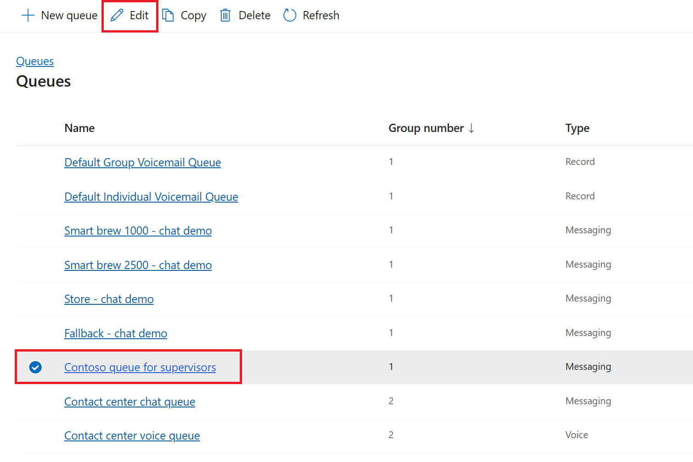
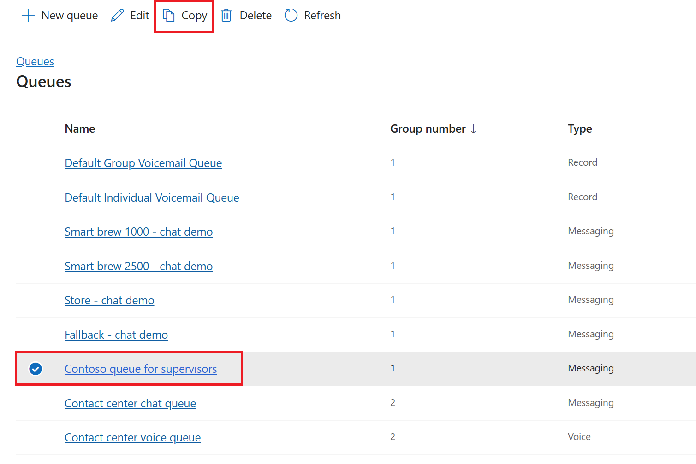

# Lab 5 - Create and manage Workstreams and Queues

**Objective** - In this Lab, you will create workstream and Queue in the customer service admin center. You will also navigate through how we manage them in the Customer Service admin center.

## Exercise 1 - Create and Manage Workstream

### Task 1 - Create a workstream

You can create workstreams for unified routing in the Customer Service
admin center app.

1.  Open a new tab in the browser. Sign in to the Power Platform admin
    center - !!https://admin.powerplatform.microsoft.com/!! with the
    credentials provided to execute the lab in the home tab. Select **> Environments>
    CustomerService Trial environment> Environment URL.**

2.  You will be navigated to **Customer Service workspace**. Click on **App selector** to display the list of apps.
   
3.  Select **Customer Service Admin center** from the list of Apps.

4.  In the site map of admin center,
    select **Workstreams** under **Customer support**.

    

5.  Select **New workstream**.

    

6.  In the **Create a workstream** dialog, enter the following details:

    - **Name**: Enter an intuitive name - `Contoso chat workstream`.

    - **Type**: Select **Messaging**

    - **Channel**: This box appears if you select the type
      as **Messaging**. Select **Chat**

    - Select **Persistent** **Chat** checkbox.

    - **Work distribution mode**: Select **Push** 

    - In **Fallback queue** – Select **Choose existing**: Select Default
      messaging queue ( All users)

    - Select **Create**.
  
    
    
    The workstream that you created is displayed with the option to configure the selected channel instance.

    

### Task 2 - Manage workstreams

1.  Select **Workstreams** on the left navigation pane under **Customer
    Support**.

2.  Select **Contoso chat workstream** on the **All workstreams** page
    and select **Edit** on the command menu to edit the workstream.

    

3.  To copy the **Contoso chat workstream**, select the workstream and
    click **Copy** on the command menu.

    

4.  Select **Copy** in the ***Do you want to copy this
    workstream?*** dialog.

    

5.  The workstream is copied and inherits the settings of the workstream
    you copied from, including its name, prefixed with **Copy of Contoso
    chat workstream.**

    

6.  To delete the workstream, select the workstream and click
    **Delete.**

## Exercise 2 - Create and Manage Queues

### Task 1 - Create a queue for unified routing

1.  In the site map of **Customer Service admin center**,
    select **Queues** in **Customer support**.

    

2.  On the **Queues** page, select **Manage** for **Advanced queues**.

    

3.  On the **Queues** page, Select **New** **Queue**

    

4.  In the **Create a queue** dialog, enter the following details:

    - **Name**: !!**Contoso queue for supervisors**!!

    - **Type**: Select **Messaging**

    - **Queue Priority**: !!**1**!!

    - Select **Create**

    

5.  The queue that you created is displayed.

6.  Select **Add users**, and in the flyout menu, select the users who
    should be part of the queue, and then select **Add**.

    
    
7.  The users are added to the queue.

    

8.  In **Assignment method**, You can see **Highest capacity** with
    **Read-only**

    

9.  To set the operating hours, in **Operation hours**, select **Set
    operation hours**.

     

10.  On the **Set operation hours** dialog that appears, click the
    dropdown next to **Select operation hours** and then click **+
    Create new**.

     
    
11.  On the **New Operating Hour** page, enter **Contoso operation
    hours** in the **Name** field and **Description** field.

12.  Click **Save & Close** to navigate back to the **Contoso queue for
    supervisors** page.

        

13. On the **Contoso queue for supervisors** page, click **+** **Set
    operation hours** again.

14. On the **Set operation hours** pane, search for and select **Contoso
    operation hours** and click **Save and close.**

    

15. The operation hours record that you selected is configured for the
    queue.

    

### Task 2 - Manage queues for unified routing

1.  On the **Queues** page, select the **Contoso queue for supervisors**
    to edit the users, assignment methods, or operating hour record.

    

2.  Select **Contoso queue for supervisors** on the **Queues** page,
    select **Copy** on the command menu.

    

3.  Select **Copy** in the ***Copy Queue*** dialog.

    

4.  The queue is copied and inherits the settings of the queue you
    copied from, including its name, prefixed with **Copy of Contoso
    queue for supervisors**.

    

**Summary** - You have created workstream and Queue in the customer service admin center. You will also navigate through how we manage them in the Customer Service admin center.
