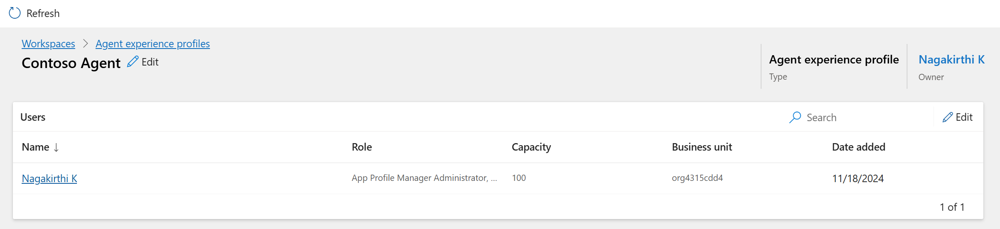
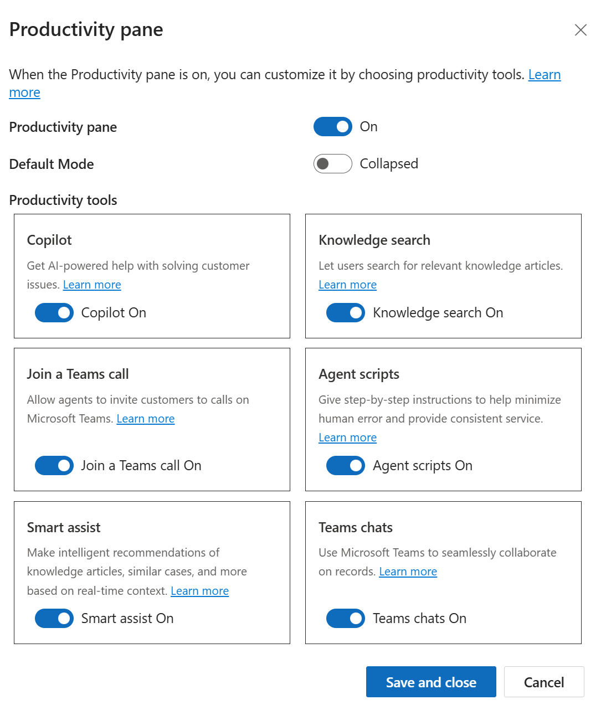

# Lab 9 - Create and use agent experience profiles

**Objective** - You will create an agent experience profile and configure parameters to the profile in the Copilot Service service center

## Task 1 - Create agent experience profiles in Copilot Service admin center

By using agent profiles, you can create targeted app experiences for
agents and supervisors. Profiles help access the features that your
agents and supervisors can use in their daily tasks to resolve customer
issues.

1.  Open a new tab in the browser. Sign in to the Power Platform admin
    center - !!https://admin.powerplatform.microsoft.com/!! with the
    credentials provided to execute the lab in the home tab. Select **> Environments>
    CustomerService Trial environment> Environment URL.**

2.  You will be navigated to **Customer Service workspace**. Click on **App selector** to display the list of apps.
   
3.  Select **Copilot Service Admin center** from the list of Apps.

4.  Go to **Experience profiles** in **Support
    experience** \> **Workspaces**.

5.  Select **New**

6.  Enter the following details on the **Create a new experience
    profile** dialog.

    - **Name:**  !!Contoso Agent!!

    - **Unique name:** !!msdyn_custom_chatagent!!

    - **Description:** !!Contoso Agent!!

    - Select **Create**.

      

7.  An Experience profile is created.

      

## Task 2 - Assign users, templates, configure productivity pane, channels

For the profile that you created, you can add users and configure option
such as specific session templates, conversation channels, and
productivity tools.

1. Open a new tab in the browser. Sign in to the Power Platform admin
    center - !!https://admin.powerplatform.microsoft.com/!! with the
    credentials provided to execute the lab in the home tab.
 
2.  In the left side panel, select **Environments**.

    

3.  Select your **Customer Service Trial** environment.
4.  Select **Settings** from the upper menu.

5. Select **Users + permissions > Users**.

6. From the upper menu, select **Add user**.

7. In the Add user pane, search for and select **Megan Bowen**. Select **Add**.

    
   
8. In the Manage security roles page, select the **System administrator** role. Select **Save**.

    
   
9. Switch back to the Copilot Service admin center tab. Go to **Experience profiles** in **Support experience > Workspaces**.
10. Select the **Contoso Agent** profile.
11. In the **Users** section, specify the agents this profile must be associated with. Select **Add Users.**

    

12. Select the user **Megan Bowen**. Select **Add.**

      

      

13. Select **Add entity session template** to link a session template to
  the profile.

    

14. On the **Entity session templates** pane, Select **Add.**

    

15. Select **Case** under **Entity.** Select **Case Entity Session – Default Template** as **Session Template**.

    
        
16. Select **Add.** Select **Save and Close.**

      

      

17. In the **Productivity pane**, select **Turn on** 

      

18. Enable the productivity tools that the agents can access when they
  work on their assigned tasks. The following productivity tool options
  are available:

      - Default mode

      - Smart assist

      - Agent scripts

      - Microsoft Teams

      - Knowledge search

      - Copilot help pane

19. Turn on the toggle against the option in the **Productivity Pane** as per the screnshot to
enable it for the agent. Select **Save and Close**

      

      

**Summary** - You have created an experience profile and configured parameters to the profile in the Copilot Admin service center.
