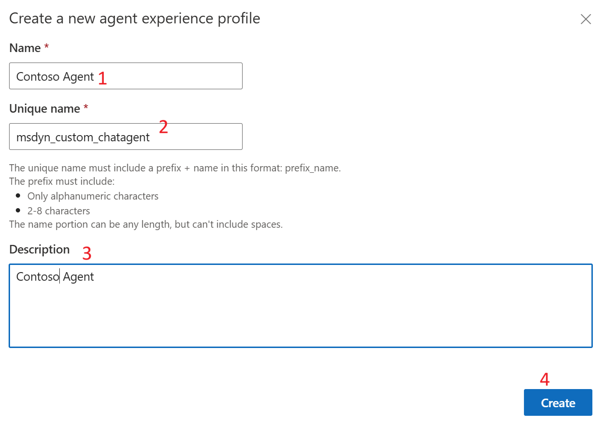

# Create and use agent experience profiles

## Task 1 - Create agent experience profiles in Customer Service admin center

By using agent profiles, you can create targeted app experiences for
agents and supervisors. Profiles help access the features that your
agents and supervisors can use in their daily tasks to resolve customer
issues.

1.  Go to **Agent experience profiles** in **Agent
    experience** \> **Workspaces**.

> 

2.  Select **New**

3.  Enter the following details on the **Create a new agent experience
    profile** dialog.

    - **Name:**  Contoso Agent

    &nbsp;

    - **Unique name:** msdyn_custom_chatagent

    &nbsp;

    - **Description:** Contoso Agent

    - Select **Create**.

1.  An agent experience profile is created.

## Task 2 - Assign users, templates, configure productivity pane, channels

For the profile that you created, you can add users and configure option
such as specific session templates, conversation channels, and
productivity tools.

Go to **Agent experience profiles** and select the required agent
experience profile. You can perform the following actions:

- In the **Users** section, specify the agents this profile must be
  associated with. Select **Add Users.** Select the admin user assigned
  to you to execute the labs. Select **Add.**

- Select **Add entity session template** to link a session template to
  the profile. On the **Entity session templates** pane, Select **Add.**
  Select **Case** under **Entity.** Select Session Template as **Case
  Entity Session – Default Template.** Select **Add.** Select **Save and
  Close.**

- In the **Productivity pane**, select **Turn on** 

- To enable the productivity tools that the agents can access when they
  work on their assigned tasks. The following productivity tool options
  are available:

  - Default mode

  - Smart assist

  - Agent scripts

  - Microsoft Teams

  - Knowledge search

  - Copilot help pane

Turn on the toggle against each option in the **Productivity Pane** to
enable it for the agent. Select **Save and Close**

